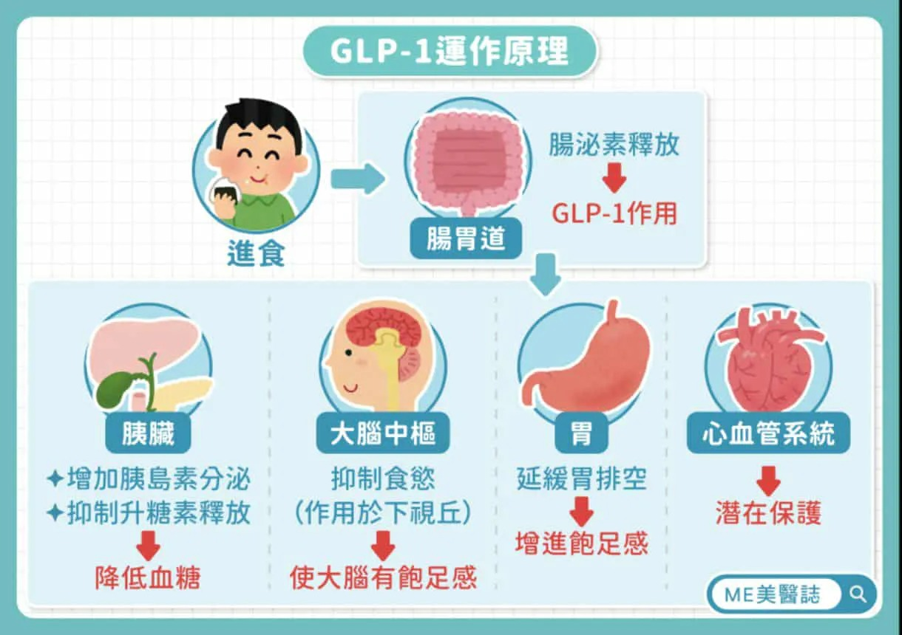

# Threads 貼文 DPKwwbvE0VS

- 帳號: [@drchenghao](https://www.threads.com/@drchenghao)（程皓醫師｜好動人生。 運動與家庭醫學，已認證）
- 貼文 URL: https://www.threads.com/@drchenghao/post/DPKwwbvE0VS
- 發文時間: 2025-09-29T09:44:03+08:00（UTC+8，時間戳 1759110243）
- 類型: photo
- 愛心數: 299
- 回覆數: 10
- 轉發數: 18
- 引用數: 44
- 備註: 貼文曾被編輯

## 貼文文字

打瘦瘦針必須知道的事，ep 18

一定要聲明，瘦瘦針
❌無法抑制脂肪生成，❌無法加強代謝
它是抑制「異位脂肪」生成！

所以，到底它有什麼功效？

1. 促胰島素分泌，穩定血糖
2. 抑制異位脂肪生成，也就是內臟脂肪生成相對減少，脂肪會在相對正常地方出現
3. 抑制胃排空，增加飽足感
4. 增加大腦中樞飽足感
5. 心肝腎保護力

如果有人跟你說它加強代謝，是在誤導你唷！
留言看更多文章🔥

## 圖片

- 原始圖片 URL: https://scontent-sin6-3.cdninstagram.com/v/t51.82787-15/554921524_17887394592446758_4351264695830836865_n.webp?efg=eyJ2ZW5jb2RlX3RhZyI6InRocmVhZHMuRkVFRC5pbWFnZV91cmxnZW4uMTIyMC5zZHIucmVndWxhcl9waG90by5jMiJ9&_nc_ht=scontent-sin6-3.cdninstagram.com&_nc_cat=110&_nc_oc=Q6cZ2gGECVPL6NuexyQoA1X-Gm-xWJfecb1g25ubmL3suuLvHwvKlF94NH1cKEdgS5y2KQPNLXvaTm4CUvrHNuitr6i3&_nc_ohc=X0PYMxQhCl0Q7kNvwEKVZU5&_nc_gid=DXPsMIzmXrrMe0p0UI-6TQ&edm=APs17CUBAAAA&ccb=7-5&ig_cache_key=MzczMjAwOTY3NTc3ODExNDg5OA%3D%3D.3-ccb7-5&oh=00_AQLAThT62Ag-cLryts3tXbpagVoPQVvTWtlXLc5Xa6yoMA&oe=6AA5D04E&_nc_sid=10d13b
- 尺寸: 1220x860
