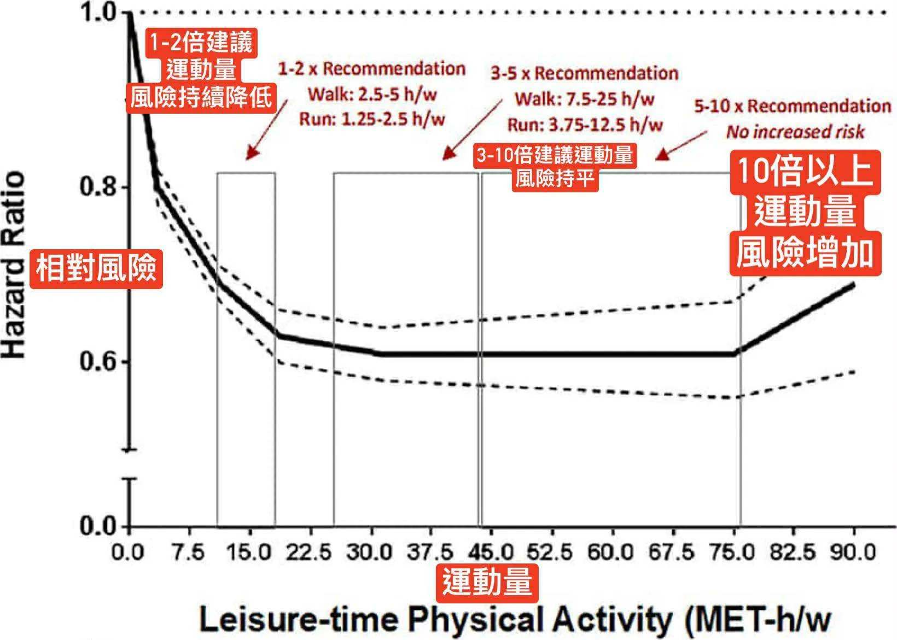

# Threads 貼文 DPRBXtSkxyl

- 帳號: [@drchenghao](https://www.threads.com/@drchenghao)（程皓醫師｜好動人生。 運動與家庭醫學，已認證）
- 貼文 URL: https://www.threads.com/@drchenghao/post/DPRBXtSkxyl
- 發文時間: 2025-10-01T20:04:40+08:00（UTC+8，時間戳 1759320280）
- 類型: photo
- 愛心數: 97
- 回覆數: 14
- 轉發數: 16
- 引用數: 2
- 備註: 貼文曾被編輯

## 貼文文字

「運動量不是越多越好，但大多數人絕對動太少」

美國運動醫學會
每週建議150-300分鐘以上中等強度運動，
能夠大幅降低死亡率和心血管風險

運動量 3-10倍，風險達到最低，且持平
運動量10倍以上，也就是每週接近1500分鐘，風險才開始提升

大部分需要煩惱的是沒有時間運動
和無法恢復長時間工作勞動後的疲勞，

真的不需要擔心運動量不足唷，能動就去動！

後面來看看文章怎麼說🔥

## 圖片

- 原始圖片 URL: https://scontent-sin6-3.cdninstagram.com/v/t51.82787-15/559415099_17888022072446758_458140103378426325_n.webp?efg=eyJ2ZW5jb2RlX3RhZyI6InRocmVhZHMuRkVFRC5pbWFnZV91cmxnZW4uMTY0MC5zZHIucmVndWxhcl9waG90by5jMiJ9&_nc_ht=scontent-sin6-3.cdninstagram.com&_nc_cat=110&_nc_oc=Q6cZ2gGECVPL6NuexyQoA1X-Gm-xWJfecb1g25ubmL3suuLvHwvKlF94NH1cKEdgS5y2KQPNLXvaTm4CUvrHNuitr6i3&_nc_ohc=3TNekdbtaFMQ7kNvwFbqnU6&_nc_gid=DXPsMIzmXrrMe0p0UI-6TQ&edm=APs17CUBAAAA&ccb=7-5&ig_cache_key=MzczMzc3MTU5MzI5MTM0MDk2NQ%3D%3D.3-ccb7-5&oh=00_AQKDRzol0rrOkU3cN-ckGqw4hdCVtlay4bcsNQJbAFPD0A&oe=6AA5F02C&_nc_sid=10d13b
- 尺寸: 1640x1171
