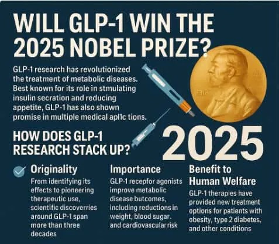

# Threads 貼文 DPdzvEbk4zn

- 帳號: [@drchenghao](https://www.threads.com/@drchenghao)（程皓醫師｜好動人生。 運動與家庭醫學，已認證）
- 貼文 URL: https://www.threads.com/@drchenghao/post/DPdzvEbk4zn
- 發文時間: 2025-10-06T19:15:39+08:00（UTC+8，時間戳 1759749339）
- 類型: photo
- 愛心數: 223
- 回覆數: 8
- 轉發數: 13
- 引用數: 13
- 備註: 貼文曾被編輯

## 貼文文字

當有人還在質疑瘦瘦針的時候，
它可能已經準備拿諾貝爾獎了！

腸泌素的生理作用，完全改變了糖尿病、肥胖的治療方式和未來發展，目的就是透過簡單、有效、可持續的方式根除這些問題。

當你還在對它有偏見時，該想的是，
你是否該好好看看文獻，
了解這個正在改變人類歷史的藥物

後面看更多相關文章👇

## 圖片

- 原始圖片 URL: https://scontent-sin6-3.cdninstagram.com/v/t51.82787-15/562058233_17889428646446758_6349168049588578358_n.webp?efg=eyJ2ZW5jb2RlX3RhZyI6InRocmVhZHMuRkVFRC5pbWFnZV91cmxnZW4uNDc3LnNkci5yZWd1bGFyX3Bob3RvLmMyIn0&_nc_ht=scontent-sin6-3.cdninstagram.com&_nc_cat=110&_nc_oc=Q6cZ2gFlJ_82ljOSjYRWE4rhGoC3SURD2k-bRzFfmMTid9gRWYZRlpn6N5tSjnVMPaR4RhZ4l6m_53hx4tcFgJwOZ3AI&_nc_ohc=agsYHJFxg50Q7kNvwFPmEN1&_nc_gid=aL2qAT71TDlRKg9YrTGfZg&edm=APs17CUBAAAA&ccb=7-5&ig_cache_key=MzczNzM3MDgwMDczMjQ3NDU5OQ%3D%3D.3-ccb7-5&oh=00_AQI2H3BpWAlE2HCTLo-4EweESPcFLfFrWvMixsVvCwHM0A&oe=6AA5D1F0&_nc_sid=10d13b
- 尺寸: 477x416
