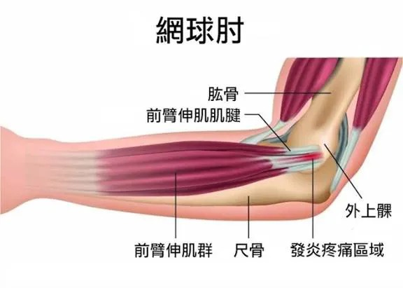

# Threads 貼文 DPgShcRk3tT

- 帳號: [@drchenghao](https://www.threads.com/@drchenghao)（程皓醫師｜好動人生。 運動與家庭醫學，已認證）
- 貼文 URL: https://www.threads.com/@drchenghao/post/DPgShcRk3tT
- 發文時間: 2025-10-07T18:23:09+08:00（UTC+8，時間戳 1759832589）
- 類型: photo
- 愛心數: 23
- 回覆數: 1
- 轉發數: 0
- 引用數: 0
- 備註: 貼文曾被編輯

## 貼文文字

不好治的網球肘，試試體外震波
不只用在結石上，還可用於骨骼肌肉問題

肱骨外側上髁炎，俗稱網球肘，
除了日常姿勢調整及物理治療，
你可以嘗試震波治療！

震波對於減輕疼痛、改善功能都有良好表現
一直好不了的話去試試吧！

## 圖片

- 原始圖片 URL: https://scontent-sin6-3.cdninstagram.com/v/t51.82787-15/560623850_17889878796446758_2868014009571170537_n.webp?efg=eyJ2ZW5jb2RlX3RhZyI6InRocmVhZHMuRkVFRC5pbWFnZV91cmxnZW4uNTc2LnNkci5yZWd1bGFyX3Bob3RvLmMyIn0&_nc_ht=scontent-sin6-3.cdninstagram.com&_nc_cat=110&_nc_oc=Q6cZ2gFlJ_82ljOSjYRWE4rhGoC3SURD2k-bRzFfmMTid9gRWYZRlpn6N5tSjnVMPaR4RhZ4l6m_53hx4tcFgJwOZ3AI&_nc_ohc=WAsH6njJiC0Q7kNvwE0jXG1&_nc_gid=aL2qAT71TDlRKg9YrTGfZg&edm=APs17CUBAAAA&ccb=7-5&ig_cache_key=MzczODA2OTE1MzY1NzA5Mjk0Nw%3D%3D.3-ccb7-5&oh=00_AQI5c9GzYzzzL--l_NbOW18B9QVopgXAa5F34MVGSROnyQ&oe=6AA5ED17&_nc_sid=10d13b
- 尺寸: 576x411
