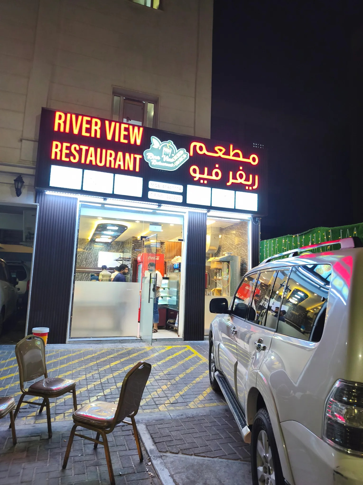
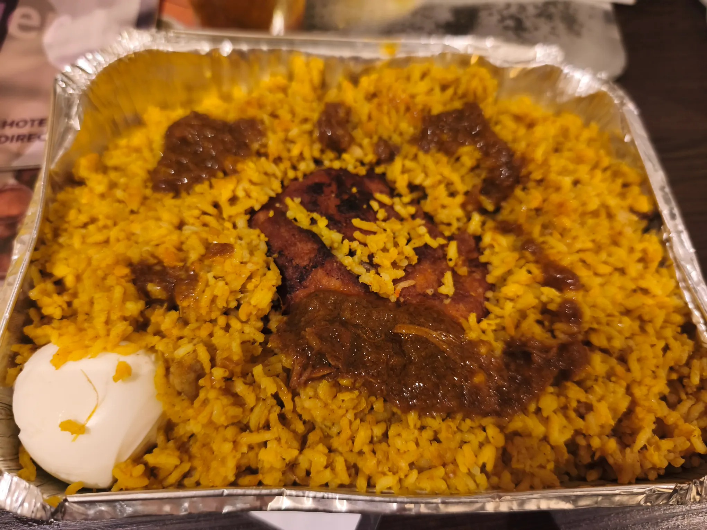

# Threads 貼文 DPhzBAUgn-k

- 帳號: [@drchenghao](https://www.threads.com/@drchenghao)（程皓醫師｜好動人生。 運動與家庭醫學，已認證）
- 貼文 URL: https://www.threads.com/@drchenghao/post/DPhzBAUgn-k
- 發文時間: 2025-10-08T08:26:20+08:00（UTC+8，時間戳 1759883180）
- 類型: carousel
- 愛心數: 30
- 回覆數: 2
- 轉發數: 0
- 引用數: 0

## 貼文文字

凌晨3點的卡達，
有24小時超市，還有幾間餐廳開著，不確定是不是因為在機場附近，都開特別晚，人也不少，治安真的很不錯

點了一份烤雞飯，老闆還幫我折扣，約莫80元
期待明天的沙漠行程還有後面研討會

## 圖片

- 原始圖片 URL: https://scontent-sin6-3.cdninstagram.com/v/t51.82787-15/561517551_17890062918446758_6878518599541067594_n.webp?efg=eyJ2ZW5jb2RlX3RhZyI6InRocmVhZHMuQ0FST1VTRUxfSVRFTS5pbWFnZV91cmxnZW4uMTUzMC5zZHIucmVndWxhcl9waG90by5jMiJ9&_nc_ht=scontent-sin6-3.cdninstagram.com&_nc_cat=110&_nc_oc=Q6cZ2gFlJ_82ljOSjYRWE4rhGoC3SURD2k-bRzFfmMTid9gRWYZRlpn6N5tSjnVMPaR4RhZ4l6m_53hx4tcFgJwOZ3AI&_nc_ohc=OGOKpXehOSEQ7kNvwGtQ1J3&_nc_gid=aL2qAT71TDlRKg9YrTGfZg&edm=APs17CUBAAAA&ccb=7-5&ig_cache_key=MzczODQ5MzUxMDg1MzI0MTM4NQ%3D%3D.3-ccb7-5&oh=00_AQLBivG_HxalgrSRCetqJtFE6q2zAX_1ifAH66wlpSFmTg&oe=6AA5CEA8&_nc_sid=10d13b
- 尺寸: 1530x2040

- 原始圖片 URL: https://scontent-sin6-3.cdninstagram.com/v/t51.82787-15/561285161_17890062921446758_6122444299148211715_n.webp?efg=eyJ2ZW5jb2RlX3RhZyI6InRocmVhZHMuQ0FST1VTRUxfSVRFTS5pbWFnZV91cmxnZW4uMjA0MC5zZHIucmVndWxhcl9waG90by5jMiJ9&_nc_ht=scontent-sin6-3.cdninstagram.com&_nc_cat=110&_nc_oc=Q6cZ2gFlJ_82ljOSjYRWE4rhGoC3SURD2k-bRzFfmMTid9gRWYZRlpn6N5tSjnVMPaR4RhZ4l6m_53hx4tcFgJwOZ3AI&_nc_ohc=-hN6trnYD_IQ7kNvwFuNFb5&_nc_gid=aL2qAT71TDlRKg9YrTGfZg&edm=APs17CUBAAAA&ccb=7-5&ig_cache_key=MzczODQ5MzUxMDg1MzIwNzc4Nw%3D%3D.3-ccb7-5&oh=00_AQIxa-rz2NZTFLNxXW2pmW6X6hTNkxG3XpwPGxMVSVQ0QA&oe=6AA5F8B5&_nc_sid=10d13b
- 尺寸: 2040x1530
