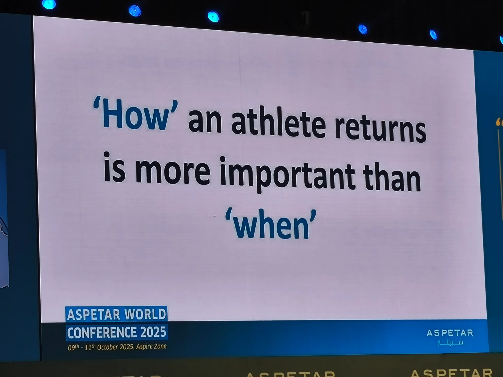

# Threads 貼文 DPnrdjfk3Dh

- 帳號: [@drchenghao](https://www.threads.com/@drchenghao)（程皓醫師｜好動人生。 運動與家庭醫學，已認證）
- 貼文 URL: https://www.threads.com/@drchenghao/post/DPnrdjfk3Dh
- 發文時間: 2025-10-10T15:15:46+08:00（UTC+8，時間戳 1760080546）
- 類型: photo
- 愛心數: 35
- 回覆數: 3
- 轉發數: 1
- 引用數: 0

## 貼文文字

Aspetar 研討會 day2：
ACL 撕裂傷，何時回場？
該注重的不是回場「時間」
而是你究竟「準備好了沒」

你的肌力、你的垂直彈跳
你的落地機制、你的變向

你需要檢測，才能知道最佳上場時機

## 圖片

- 原始圖片 URL: https://scontent-sin6-3.cdninstagram.com/v/t51.82787-15/561769535_17890574769446758_3114802398343213509_n.webp?efg=eyJ2ZW5jb2RlX3RhZyI6InRocmVhZHMuRkVFRC5pbWFnZV91cmxnZW4uMjA0MC5zZHIucmVndWxhcl9waG90by5jMiJ9&_nc_ht=scontent-sin6-3.cdninstagram.com&_nc_cat=110&_nc_oc=Q6cZ2gFlJ_82ljOSjYRWE4rhGoC3SURD2k-bRzFfmMTid9gRWYZRlpn6N5tSjnVMPaR4RhZ4l6m_53hx4tcFgJwOZ3AI&_nc_ohc=u11coRLGw5MQ7kNvwEUxPi6&_nc_gid=aL2qAT71TDlRKg9YrTGfZg&edm=APs17CUBAAAA&ccb=7-5&ig_cache_key=Mzc0MDE0OTE2MjUzMDAwOTMxMw%3D%3D.3-ccb7-5&oh=00_AQKFsxlDTokj9cX8um4QrXrkMLPgOOL7Xy-oJpRlodGTtg&oe=6AA5E8A1&_nc_sid=10d13b
- 尺寸: 2040x1530
