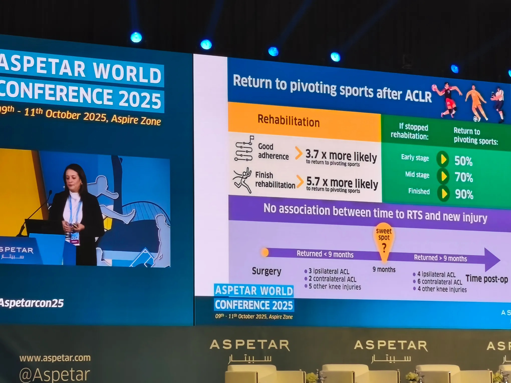

# Threads 貼文 DPnrq8-k278

- 帳號: [@drchenghao](https://www.threads.com/@drchenghao)（程皓醫師｜好動人生。 運動與家庭醫學，已認證）
- 貼文 URL: https://www.threads.com/@drchenghao/post/DPnrq8-k278
- 發文時間: 2025-10-10T15:17:36+08:00（UTC+8，時間戳 1760080656）
- 類型: photo
- 愛心數: 5
- 回覆數: 0
- 轉發數: 0
- 引用數: 0
- 備註: 此貼文為作者回覆自己的續文（self-thread），屬於同時發布的貼文群組 [DPnrdjfk3Dh](https://www.threads.com/@drchenghao/post/DPnrdjfk3Dh)

## 貼文文字

甜蜜時間點可能是 9個月
但你需要持續努力、好好完成完整訓練

## 圖片

- 原始圖片 URL: https://scontent-sin6-3.cdninstagram.com/v/t51.82787-15/563471827_17890575006446758_6048978268149829631_n.webp?efg=eyJ2ZW5jb2RlX3RhZyI6InRocmVhZHMuRkVFRC5pbWFnZV91cmxnZW4uMjA0MC5zZHIucmVndWxhcl9waG90by5jMiJ9&_nc_ht=scontent-sin6-3.cdninstagram.com&_nc_cat=110&_nc_oc=Q6cZ2gFlJ_82ljOSjYRWE4rhGoC3SURD2k-bRzFfmMTid9gRWYZRlpn6N5tSjnVMPaR4RhZ4l6m_53hx4tcFgJwOZ3AI&_nc_ohc=yBAou9tM49wQ7kNvwGqGUYn&_nc_gid=aL2qAT71TDlRKg9YrTGfZg&edm=APs17CUBAAAA&ccb=7-5&ig_cache_key=Mzc0MDE1MDA4MzI0Njg0NTY5Mg%3D%3D.3-ccb7-5&oh=00_AQI3jU_meoHJKu94VbEMcUByFRe49EpBBqQ_ra__py5shg&oe=6AA5EC1D&_nc_sid=10d13b
- 尺寸: 2040x1530
