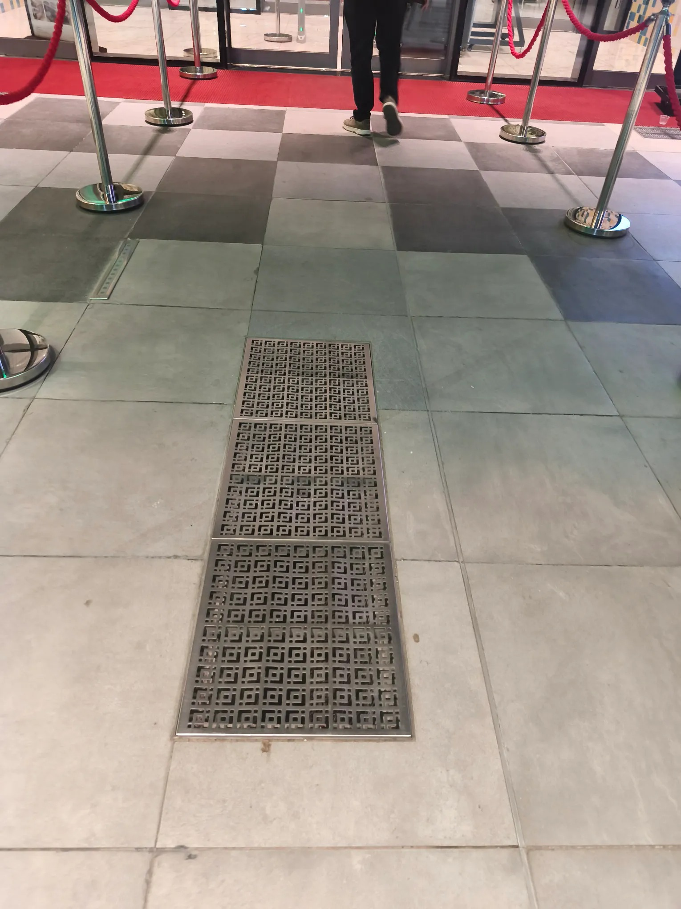

# Threads 貼文 DPp7MMqAu7m

- 帳號: [@drchenghao](https://www.threads.com/@drchenghao)（程皓醫師｜好動人生。 運動與家庭醫學，已認證）
- 貼文 URL: https://www.threads.com/@drchenghao/post/DPp7MMqAu7m
- 發文時間: 2025-10-11T12:11:41+08:00（UTC+8，時間戳 1760155901）
- 類型: carousel
- 愛心數: 68
- 回覆數: 0
- 轉發數: 0
- 引用數: 0

## 貼文文字

卡達的炫富從地板開始，
餐廳的地面上有 ”地冷氣”

讓你在30度的外界溫度下依然從地感到涼爽
超爽，所以某些街道上，晚上超熱鬧

## 圖片

- 原始圖片 URL: https://scontent-sin6-3.cdninstagram.com/v/t51.82787-15/562649792_17890781454446758_789359113786924096_n.webp?efg=eyJ2ZW5jb2RlX3RhZyI6InRocmVhZHMuQ0FST1VTRUxfSVRFTS5pbWFnZV91cmxnZW4uMTUzMC5zZHIucmVndWxhcl9waG90by5jMiJ9&_nc_ht=scontent-sin6-3.cdninstagram.com&_nc_cat=110&_nc_oc=Q6cZ2gFlJ_82ljOSjYRWE4rhGoC3SURD2k-bRzFfmMTid9gRWYZRlpn6N5tSjnVMPaR4RhZ4l6m_53hx4tcFgJwOZ3AI&_nc_ohc=_zZFlTHNJWIQ7kNvwH0jdwG&_nc_gid=aL2qAT71TDlRKg9YrTGfZg&edm=APs17CUBAAAA&ccb=7-5&ig_cache_key=Mzc0MDc4MTI3MzkxMjg1NDM5MA%3D%3D.3-ccb7-5&oh=00_AQIYRcur2b9q4hL10V541CQX4dGoO44Dh3Po0arB60JWdA&oe=6AA5E49B&_nc_sid=10d13b
- 尺寸: 1530x2040

- 原始圖片 URL: https://scontent-sin6-3.cdninstagram.com/v/t51.82787-15/564226608_17890781448446758_2598398371740082165_n.webp?efg=eyJ2ZW5jb2RlX3RhZyI6InRocmVhZHMuQ0FST1VTRUxfSVRFTS5pbWFnZV91cmxnZW4uMjA0MC5zZHIucmVndWxhcl9waG90by5jMiJ9&_nc_ht=scontent-sin6-3.cdninstagram.com&_nc_cat=110&_nc_oc=Q6cZ2gFlJ_82ljOSjYRWE4rhGoC3SURD2k-bRzFfmMTid9gRWYZRlpn6N5tSjnVMPaR4RhZ4l6m_53hx4tcFgJwOZ3AI&_nc_ohc=S9AN-yhpp4AQ7kNvwFXM0A8&_nc_gid=aL2qAT71TDlRKg9YrTGfZg&edm=APs17CUBAAAA&ccb=7-5&ig_cache_key=Mzc0MDc4MTI3MzkxMjg5NzM1Mw%3D%3D.3-ccb7-5&oh=00_AQIt3WDAT-D-uWwOQhrKqlyKi-6Apdhli1V_5_UzV1yJWA&oe=6AA5D3A6&_nc_sid=10d13b
- 尺寸: 2040x1530
