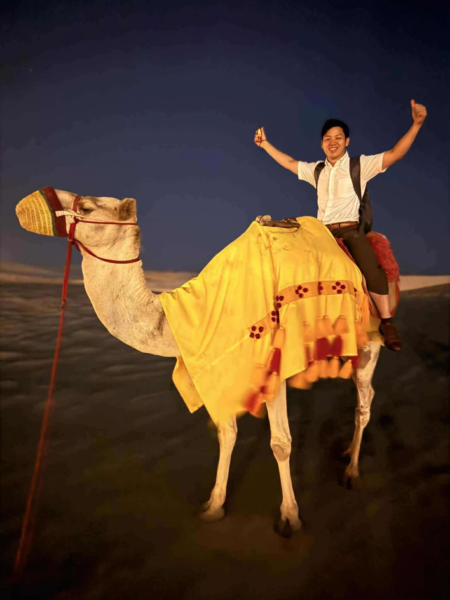
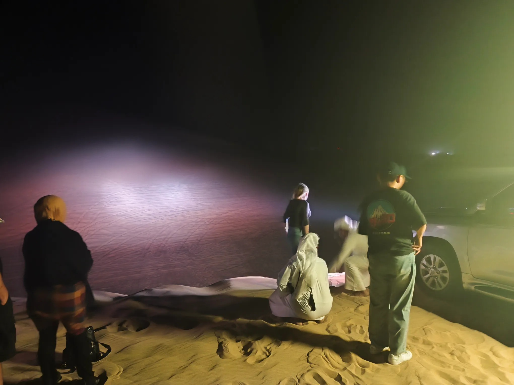

# Threads 貼文 DPvWhjEk7K3

- 帳號: [@drchenghao](https://www.threads.com/@drchenghao)（程皓醫師｜好動人生。 運動與家庭醫學，已認證）
- 貼文 URL: https://www.threads.com/@drchenghao/post/DPvWhjEk7K3
- 發文時間: 2025-10-13T14:46:44+08:00（UTC+8，時間戳 1760338004）
- 類型: carousel
- 愛心數: 34
- 回覆數: 4
- 轉發數: 0
- 引用數: 0

## 貼文文字

卡達的夜騎駱駝、滑沙

頂著月光騎駱駝看星星，
摸黑在沙漠中開吉普車，
非常棒又特別的體驗

重點是跟白天相比，完全不會熱
推薦給準備來卡達的朋友

## 圖片

- 原始圖片 URL: https://scontent-sin6-3.cdninstagram.com/v/t51.82787-15/565091550_17891406423446758_946531524180034285_n.webp?efg=eyJ2ZW5jb2RlX3RhZyI6InRocmVhZHMuQ0FST1VTRUxfSVRFTS5pbWFnZV91cmxnZW4uMTUzNi5zZHIucmVndWxhcl9waG90by5jMiJ9&_nc_ht=scontent-sin6-3.cdninstagram.com&_nc_cat=110&_nc_oc=Q6cZ2gEnyXsOZ0bTh5ibOGUJCIzCq6ezzZbbnHUQJkYbjnt30HiWkiRQrVfBkChfz98QiXr4J2mbjZ5Juv1WTkAVAZF4&_nc_ohc=FazCy1OLo2oQ7kNvwFUw-Ys&_nc_gid=M09jXC8babhmVMvbDXCzWA&edm=APs17CUBAAAA&ccb=7-5&ig_cache_key=Mzc0MjMwODg3MjQ4MTkyOTI2Mw%3D%3D.3-ccb7-5&oh=00_AQIoRsvSQ4973jIMIHVlPVG0k6S-wco_pMuicCa0kwuB0g&oe=6AA5EB2F&_nc_sid=10d13b
- 尺寸: 1536x2048

- 原始圖片 URL: https://scontent-sin6-3.cdninstagram.com/v/t51.82787-15/564246731_17891406420446758_9084671971398578787_n.webp?efg=eyJ2ZW5jb2RlX3RhZyI6InRocmVhZHMuQ0FST1VTRUxfSVRFTS5pbWFnZV91cmxnZW4uMjA0MC5zZHIucmVndWxhcl9waG90by5jMiJ9&_nc_ht=scontent-sin6-3.cdninstagram.com&_nc_cat=110&_nc_oc=Q6cZ2gEnyXsOZ0bTh5ibOGUJCIzCq6ezzZbbnHUQJkYbjnt30HiWkiRQrVfBkChfz98QiXr4J2mbjZ5Juv1WTkAVAZF4&_nc_ohc=UoBLtav-6F8Q7kNvwGNr43q&_nc_gid=M09jXC8babhmVMvbDXCzWA&edm=APs17CUBAAAA&ccb=7-5&ig_cache_key=Mzc0MjMwODg3MjYyNDUyMzc3OA%3D%3D.3-ccb7-5&oh=00_AQLX3zjICfTF3rTsSgn7SN_SKtJsf3vWYRAQcnXGPpSktQ&oe=6AA5D32D&_nc_sid=10d13b
- 尺寸: 2040x1530
