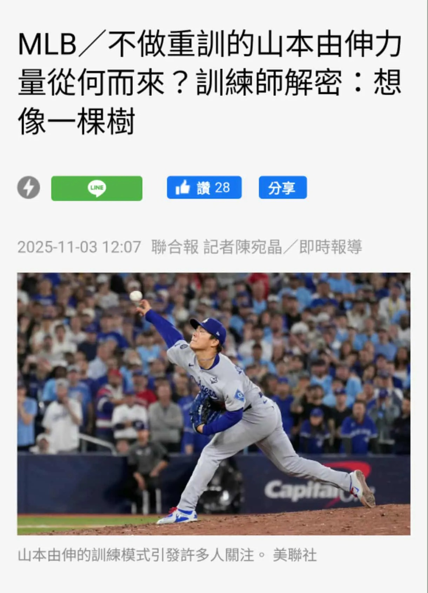

# Threads 貼文 DQoEeVBE2tA

- 帳號: [@drchenghao](https://www.threads.com/@drchenghao)（程皓醫師｜好動人生。 運動與家庭醫學，已認證）
- 貼文 URL: https://www.threads.com/@drchenghao/post/DQoEeVBE2tA
- 發文時間: 2025-11-04T15:25:43+08:00（UTC+8，時間戳 1762241143）
- 類型: photo
- 愛心數: 62
- 回覆數: 12
- 轉發數: 1
- 引用數: 0

## 貼文文字

新聞說 山本的「不做重訓」，是代表我們完全不需要深蹲硬舉嗎？

其實不是的，以下幾個分享👇

1. 他的「重訓」非傳統大眾認知的深蹲硬舉，職業運動員其實需要結合，速度、敏捷、反應、核心、協調性、爆發力等，需要有多元動作，但其實廣義上而言，它依然是重訓。

2. 山本深蹲硬舉之儲備肌力早已達標，因此近期訓練以加強弱點項目，只為求更好運動表現。

小小一句話分享，訓練需依球員個別化調整，
影響包括專項、賽季、傷勢、疲勞等等，因此
「沒有最完美，只有最適合該選手的訓練」

底下看更多文章🔥

## 圖片

- 原始圖片 URL: https://scontent-sin6-3.cdninstagram.com/v/t51.82787-15/573431275_17897044236446758_4681985874851511174_n.webp?efg=eyJ2ZW5jb2RlX3RhZyI6InRocmVhZHMuRkVFRC5pbWFnZV91cmxnZW4uMTIyMC5zZHIucmVndWxhcl9waG90by5jMiJ9&_nc_ht=scontent-sin6-3.cdninstagram.com&_nc_cat=110&_nc_oc=Q6cZ2gH1E7Ny75FeolS2vImVvHpVwmmBp7kdmrA281QNzf0W1nE6JEfA7KrIs3Hsb0ZUukxz3Qct8fVLh8ur2PlAbY9i&_nc_ohc=AKSHtm3KUQYQ7kNvwEMrkLk&_nc_gid=M0ZJGaoPh7k4Eicl2Lleuw&edm=APs17CUBAAAA&ccb=7-5&ig_cache_key=Mzc1ODI3MzU2NTM3NzY1MzU2OA%3D%3D.3-ccb7-5&oh=00_AQLsm_fPoUujmETDE5cAA_LrpcgHGr-vGUTTKft5Pm2QLQ&oe=6AA5D9C4&_nc_sid=10d13b
- 尺寸: 1220x1688
