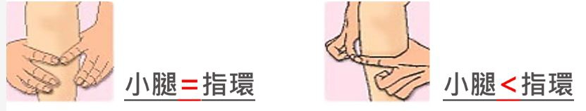

# Threads 貼文 DQyq8e-k_3e

- 帳號: [@drchenghao](https://www.threads.com/@drchenghao)（程皓醫師｜好動人生。 運動與家庭醫學，已認證）
- 貼文 URL: https://www.threads.com/@drchenghao/post/DQyq8e-k_3e
- 發文時間: 2025-11-08T18:14:17+08:00（UTC+8，時間戳 1762596857）
- 類型: photo
- 愛心數: 13
- 回覆數: 0
- 轉發數: 0
- 引用數: 0
- 備註: 此貼文為作者回覆自己的續文（self-thread），屬於同時發布的貼文群組 [DQyqa56k6EM](https://www.threads.com/@drchenghao/post/DQyqa56k6EM)

## 貼文文字

指環測試，小腿圍小於拇指與食指圍成之圓
即可能為肌少症

## 圖片

- 原始圖片 URL: https://scontent-sin6-3.cdninstagram.com/v/t51.82787-15/574401689_17897879202446758_3635690021120011423_n.jpg?stp=dst-jpg_e35_tt6&efg=eyJ2ZW5jb2RlX3RhZyI6InRocmVhZHMuRkVFRC5pbWFnZV91cmxnZW4uODMxLnNkci5yZWd1bGFyX3Bob3RvLmMyIn0&_nc_ht=scontent-sin6-3.cdninstagram.com&_nc_cat=110&_nc_oc=Q6cZ2gH1E7Ny75FeolS2vImVvHpVwmmBp7kdmrA281QNzf0W1nE6JEfA7KrIs3Hsb0ZUukxz3Qct8fVLh8ur2PlAbY9i&_nc_ohc=or-jcxAAo9IQ7kNvwHCbr2Y&_nc_gid=M0ZJGaoPh7k4Eicl2Lleuw&edm=APs17CUBAAAA&ccb=7-5&ig_cache_key=Mzc2MTI1NzUxMzE5MTk5Njg5NA%3D%3D.3-ccb7-5&oh=00_AQJGMGsjM4M2iu_mXcnoqX76aj8nMXLyJOcnb04JBmhYgw&oe=6AA5D3D0&_nc_sid=10d13b
- 尺寸: 831x158
