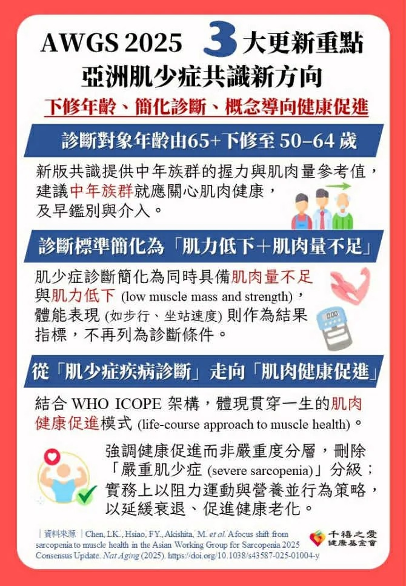

# Threads 貼文 DQyqa56k6EM

- 帳號: [@drchenghao](https://www.threads.com/@drchenghao)（程皓醫師｜好動人生。 運動與家庭醫學，已認證）
- 貼文 URL: https://www.threads.com/@drchenghao/post/DQyqa56k6EM
- 發文時間: 2025-11-08T18:09:42+08:00（UTC+8，時間戳 1762596582）
- 類型: photo
- 愛心數: 136
- 回覆數: 21
- 轉發數: 22
- 引用數: 8
- 備註: 貼文曾被編輯

## 貼文文字

❗2025年最新肌少症共識，50歲就要重視❗
診斷簡化為，肌力低下 + 肌肉量不足

肌力標準：
≥65歲：男<28、女<18公斤
50–64：男<34、女<20公斤	

肌肉量標準：
DXA 為最標準檢查
小腿圍 (Calf circumference): 
男性 < 34 公分；女性 < 33 公分
指環測試 (Yubi-wakka test): 異常標準，小腿最粗處與指環間有空隙

因此未來不會再用起立坐下、坐站速度作為篩檢，並且以肌肉健康促進為第一優先，阻力運動與營養並進！🔥

各位朋友可以抽空測試一下，其實標準不容易唷，另外，減重之餘也要注意肌肉量❗

## 圖片

- 原始圖片 URL: https://scontent-sin6-3.cdninstagram.com/v/t51.82787-15/574534979_17897876973446758_8920504066836583755_n.webp?efg=eyJ2ZW5jb2RlX3RhZyI6InRocmVhZHMuRkVFRC5pbWFnZV91cmxnZW4uNjcwLnNkci5yZWd1bGFyX3Bob3RvLmMyIn0&_nc_ht=scontent-sin6-3.cdninstagram.com&_nc_cat=110&_nc_oc=Q6cZ2gH1E7Ny75FeolS2vImVvHpVwmmBp7kdmrA281QNzf0W1nE6JEfA7KrIs3Hsb0ZUukxz3Qct8fVLh8ur2PlAbY9i&_nc_ohc=4D0Ay5BYhYEQ7kNvwEP6cmQ&_nc_gid=M0ZJGaoPh7k4Eicl2Lleuw&edm=APs17CUBAAAA&ccb=7-5&ig_cache_key=Mzc2MTI1NTIwNTY1MzY4NDQ5Mg%3D%3D.3-ccb7-5&oh=00_AQJcx-O-6tHW4_IEdJXVPK0qPykxgJGKI_Ef1Sm2Jb_qgg&oe=6AA5EC86&_nc_sid=10d13b
- 尺寸: 670x967
