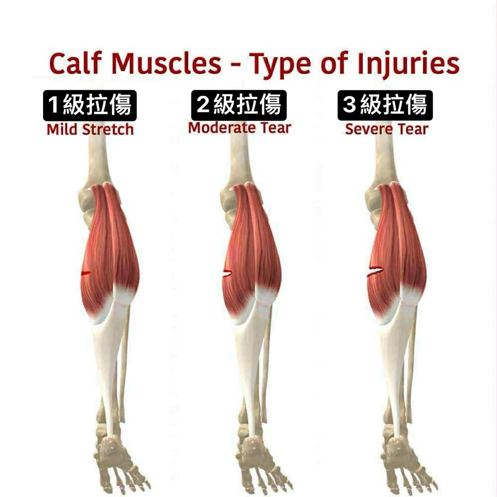

# Threads 貼文 DRLpyoZk8lY

- 帳號: [@drchenghao](https://www.threads.com/@drchenghao)（程皓醫師｜好動人生。 運動與家庭醫學，已認證）
- 貼文 URL: https://www.threads.com/@drchenghao/post/DRLpyoZk8lY
- 發文時間: 2025-11-18T11:05:13+08:00（UTC+8，時間戳 1763435113）
- 類型: photo
- 愛心數: 10
- 回覆數: 3
- 轉發數: 0
- 引用數: 2

## 貼文文字

❗NBA傷員不斷，Wemby、Morant，都出現小腿肌拉傷，多久有機會回場❗

❗懶人包：
回場時間取決於他症狀嚴重程度跟功能性，若MRI檢查無嚴重撕裂，1級拉傷大約最快 2-4 週可回場！

👉小腿肌撕裂傷如何發生？

小腿肌撕裂傷是相當常見的運動員傷害，常見於未熱身完全的運動員於變向或衝刺時發生，於網球選手發生時也被稱作網球腿。

👉小腿肌主要有哪些？

小腿肌群主要由表層腓腸肌和深層比目魚肌組成，各司其職。
腓腸肌撕裂傷較比目魚肌撕裂傷發生率更高。

👉多久能回場，該如何治療？

回場時間取決於受傷位置和嚴重程度，若是症狀輕微及影像上無明顯問題，1級拉傷，大概率 2-4 週能快速回場。

足球球員研究，若是比目魚肌中央腱膜傷 ，最嚴重，平均需44天才能回場。其他位置較輕微，最快約16天回場。
但再傷率可能高達30%。

後續透過增生治療，結合適當的物理治療及肌群訓練，大多數球員能完全恢復，無後遺症唷！

留言附文章

## 圖片

- 原始圖片 URL: https://scontent-sin6-3.cdninstagram.com/v/t51.82787-15/582096609_17899618878446758_5266911019355210093_n.webp?efg=eyJ2ZW5jb2RlX3RhZyI6InRocmVhZHMuRkVFRC5pbWFnZV91cmxnZW4uMTY0MC5zZHIucmVndWxhcl9waG90by5jMiJ9&_nc_ht=scontent-sin6-3.cdninstagram.com&_nc_cat=110&_nc_oc=Q6cZ2gE2bQz2enuPtLAJtAZ-UVbWIqoBQ9l_lw_SOufXj8GugG4CPTJKglIDrd-0Izoc51JxXXZXcq48rofZ41WzAIlp&_nc_ohc=66HTEyGM8d4Q7kNvwHsU-Od&_nc_gid=01X1h0n8YHljPyrOJPFzlg&edm=APs17CUBAAAA&ccb=7-5&ig_cache_key=Mzc2ODI4OTMxMjQ4NTEzMjYzMg%3D%3D.3-ccb7-5&oh=00_AQKclXqaP-Y6ryiHfXT0JdbWvrHQrgul1Xt79fCia0UGNQ&oe=6AA5DF52&_nc_sid=10d13b
- 尺寸: 1640x1640
