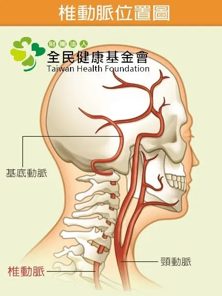

# Threads 貼文 DRMR-HnE9Hz

- 帳號: [@drchenghao](https://www.threads.com/@drchenghao)（程皓醫師｜好動人生。 運動與家庭醫學，已認證）
- 貼文 URL: https://www.threads.com/@drchenghao/post/DRMR-HnE9Hz
- 發文時間: 2025-11-18T16:56:19+08:00（UTC+8，時間戳 1763456179）
- 類型: photo
- 愛心數: 15
- 回覆數: 0
- 轉發數: 0
- 引用數: 0
- 備註: 此貼文為作者回覆自己的續文（self-thread），屬於同時發布的貼文群組 [DRMRrwRk598](https://www.threads.com/@drchenghao/post/DRMRrwRk598)

## 貼文文字

頸部血管圖，
頸部按摩可能導致此處血流減少，也可能在操作過程導致血管內皮受損，若原先有血管狹窄問題，可能導致缺血性中風！

## 圖片

- 原始圖片 URL: https://scontent-sin6-3.cdninstagram.com/v/t51.82787-15/582301697_17899652034446758_5137754496628265437_n.webp?efg=eyJ2ZW5jb2RlX3RhZyI6InRocmVhZHMuRkVFRC5pbWFnZV91cmxnZW4uNDUwLnNkci5yZWd1bGFyX3Bob3RvLmMyIn0&_nc_ht=scontent-sin6-3.cdninstagram.com&_nc_cat=110&_nc_oc=Q6cZ2gE2bQz2enuPtLAJtAZ-UVbWIqoBQ9l_lw_SOufXj8GugG4CPTJKglIDrd-0Izoc51JxXXZXcq48rofZ41WzAIlp&_nc_ohc=YIYZ2iCvZh4Q7kNvwHaiPJJ&_nc_gid=01X1h0n8YHljPyrOJPFzlg&edm=APs17CUBAAAA&ccb=7-5&ig_cache_key=Mzc2ODQ2NjAyMzc3MjMxMjA1MQ%3D%3D.3-ccb7-5&oh=00_AQI8LSy3_Ht_cBn4JYM3b47WO9a7MEINGiKaHBVqSg0krg&oe=6AA5F215&_nc_sid=10d13b
- 尺寸: 450x600
