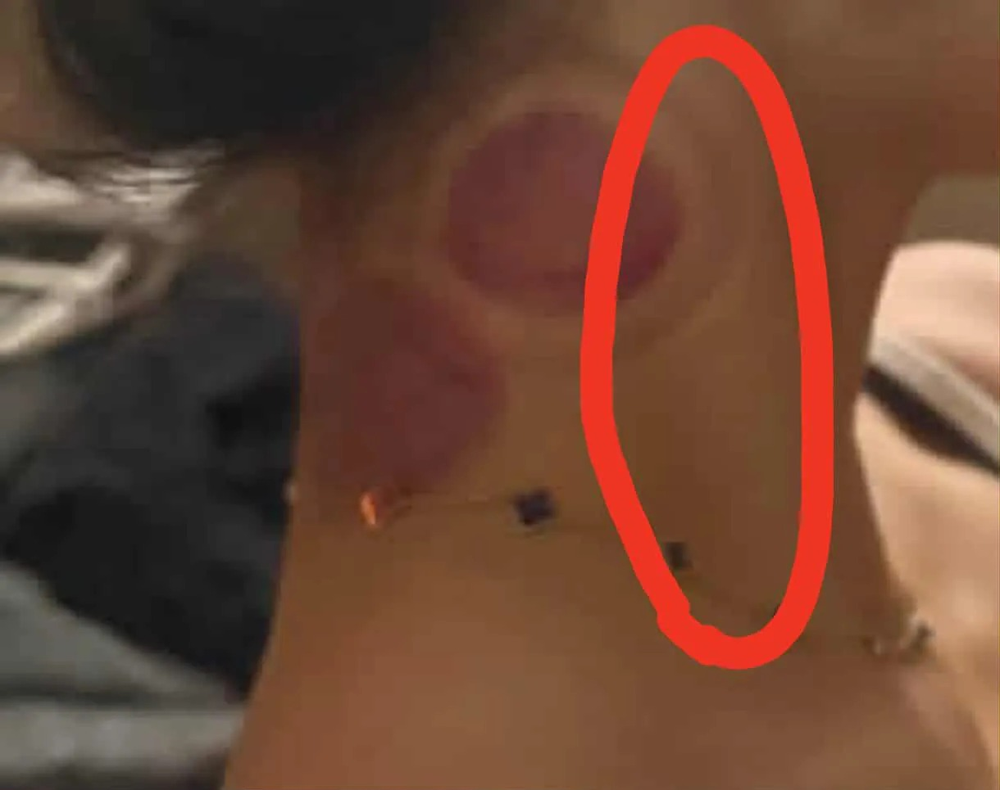

# Threads 貼文 DRMRrwRk598

- 帳號: [@drchenghao](https://www.threads.com/@drchenghao)（程皓醫師｜好動人生。 運動與家庭醫學，已認證）
- 貼文 URL: https://www.threads.com/@drchenghao/post/DRMRrwRk598
- 發文時間: 2025-11-18T16:53:48+08:00（UTC+8，時間戳 1763456028）
- 類型: photo
- 愛心數: 46
- 回覆數: 4
- 轉發數: 3
- 引用數: 3
- 備註: 貼文曾被編輯

## 貼文文字

拔罐可以幫助肌肉放鬆、增加循環
但請避免頸部前側區域，
因此處有非常重要的頸動脈❗❗

隨意於此處拔罐或按摩，
可能導致暈眩甚至中風！

請別要求處理這裡，
甚至看到師父處理這，要快跑呀🏃

👇下面看頸部解剖圖

## 圖片

- 原始圖片 URL: https://scontent-sin6-3.cdninstagram.com/v/t51.82787-15/584346074_17899651992446758_742348039916466565_n.webp?efg=eyJ2ZW5jb2RlX3RhZyI6InRocmVhZHMuRkVFRC5pbWFnZV91cmxnZW4uMTIyMC5zZHIucmVndWxhcl9waG90by5jMiJ9&_nc_ht=scontent-sin6-3.cdninstagram.com&_nc_cat=110&_nc_oc=Q6cZ2gE2bQz2enuPtLAJtAZ-UVbWIqoBQ9l_lw_SOufXj8GugG4CPTJKglIDrd-0Izoc51JxXXZXcq48rofZ41WzAIlp&_nc_ohc=Lb1w_y49bv0Q7kNvwF_tjJJ&_nc_gid=01X1h0n8YHljPyrOJPFzlg&edm=APs17CUBAAAA&ccb=7-5&ig_cache_key=Mzc2ODQ2NDc2MTc2NDk0NTc4OA%3D%3D.3-ccb7-5&oh=00_AQJCMAssFL88SnkPDyia_mhth99bD1yAvBsyMDHx5QDl_A&oe=6AA5F1F5&_nc_sid=10d13b
- 尺寸: 1220x965
