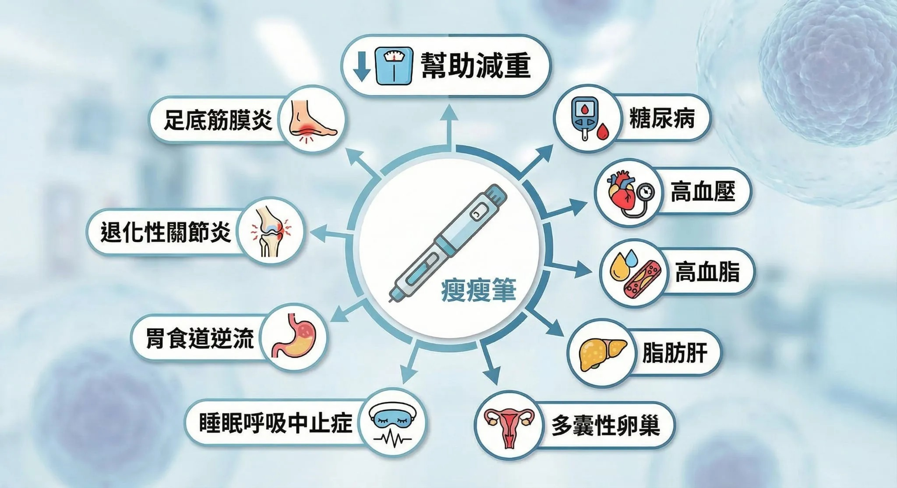

# Threads 貼文 DRjolVOkqEA

- 帳號: [@drchenghao](https://www.threads.com/@drchenghao)（程皓醫師｜好動人生。 運動與家庭醫學，已認證）
- 貼文 URL: https://www.threads.com/@drchenghao/post/DRjolVOkqEA
- 發文時間: 2025-11-27T18:36:26+08:00（UTC+8，時間戳 1764239786）
- 類型: photo
- 愛心數: 432
- 回覆數: 23
- 轉發數: 33
- 引用數: 66

## 貼文文字

瘦瘦筆（腸泌素）除了用來幫助減重，
更讓人印象深刻的是它對以下疾病的好處

糖尿病、高血壓、高血脂、脂肪肝、多囊性卵巢、睡眠呼吸中止症、胃食道逆流、退化性關節炎、足底筋膜炎等等

當有過重情況，減重後，這些疾病都能改善

而這些疾病都是我門診原本就有在處理的問題，因此對我來說，它就是一個劃時代的發明、值得持續推廣讓更多人知道及使用。

## 圖片

- 原始圖片 URL: https://scontent-sin6-3.cdninstagram.com/v/t51.82787-15/588959156_17901209271446758_5159032448366600737_n.webp?efg=eyJ2ZW5jb2RlX3RhZyI6InRocmVhZHMuRkVFRC5pbWFnZV91cmxnZW4uMjA0OC5zZHIucmVndWxhcl9waG90by5jMiJ9&_nc_ht=scontent-sin6-3.cdninstagram.com&_nc_cat=110&_nc_oc=Q6cZ2gE2bQz2enuPtLAJtAZ-UVbWIqoBQ9l_lw_SOufXj8GugG4CPTJKglIDrd-0Izoc51JxXXZXcq48rofZ41WzAIlp&_nc_ohc=039yoDEVNtIQ7kNvwHEuw1P&_nc_gid=01X1h0n8YHljPyrOJPFzlg&edm=APs17CUBAAAA&ccb=7-5&ig_cache_key=Mzc3NTAzOTM5OTk0MDc1OTgwOA%3D%3D.3-ccb7-5&oh=00_AQJn596TkVsqRrSI5UBbHoone-rjWg_Ir70K05feVWytmw&oe=6AA5E468&_nc_sid=10d13b
- 尺寸: 2048x1117
