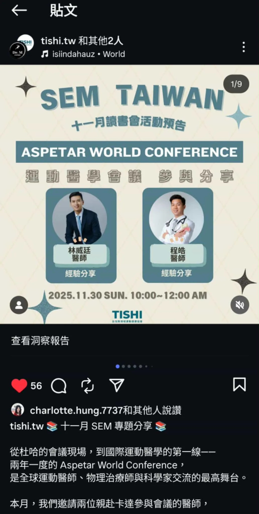

# Threads 貼文 DRpB0sgExz8

- 帳號: [@drchenghao](https://www.threads.com/@drchenghao)（程皓醫師｜好動人生。 運動與家庭醫學，已認證）
- 貼文 URL: https://www.threads.com/@drchenghao/post/DRpB0sgExz8
- 發文時間: 2025-11-29T20:53:11+08:00（UTC+8，時間戳 1764420791）
- 類型: photo
- 愛心數: 14
- 回覆數: 1
- 轉發數: 0
- 引用數: 0
- 備註: 貼文曾被編輯

## 貼文文字

明天11/30 10：00-12：00 會在 
SEM 專題分享，主題內容為，
卡達運動醫學醫院會議及參訪

同時也會分享卡達的旅遊心得唷！
有興趣的朋友可以參考 TISHI首頁唷~

## 圖片

- 原始圖片 URL: https://scontent-sin6-3.cdninstagram.com/v/t51.82787-15/589354905_17901574806446758_647473779823181789_n.webp?efg=eyJ2ZW5jb2RlX3RhZyI6InRocmVhZHMuRkVFRC5pbWFnZV91cmxnZW4uMTAzMi5zZHIucmVndWxhcl9waG90by5jMiJ9&_nc_ht=scontent-sin6-3.cdninstagram.com&_nc_cat=110&_nc_oc=Q6cZ2gGUaiDPgquLGa8uyYxkH9nv5qIix8vo1aMh9QBjT4bYQ_dXPuSgAE54I4PyhnF2VAHODfOIziRUFNPDh12jXEin&_nc_ohc=P5SxaLbtDYQQ7kNvwElmOoC&_nc_gid=k5Eo01F93HtcYIak7qNFJA&edm=APs17CUBAAAA&ccb=7-5&ig_cache_key=Mzc3NjU1Nzc4MTc2ODkzNjcwMA%3D%3D.3-ccb7-5&oh=00_AQImpwFRdWJvhTw7oZFIhpLuiM9EFa1iJydxOiIH56ZLwg&oe=6AA5F45C&_nc_sid=10d13b
- 尺寸: 1032x2047
