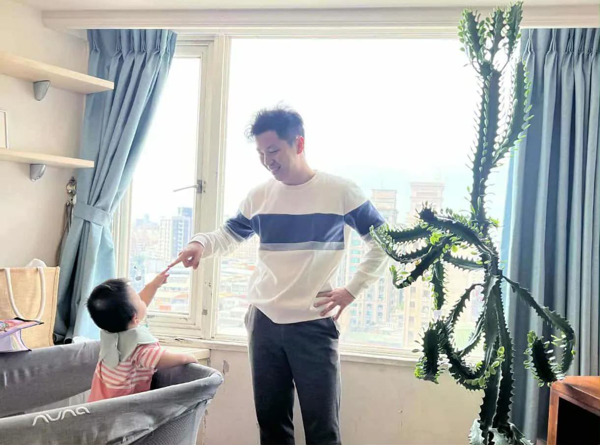

# Threads 貼文 DRrgTw_k3bX

- 帳號: [@drchenghao](https://www.threads.com/@drchenghao)（程皓醫師｜好動人生。 運動與家庭醫學，已認證）
- 貼文 URL: https://www.threads.com/@drchenghao/post/DRrgTw_k3bX
- 發文時間: 2025-11-30T19:58:03+08:00（UTC+8，時間戳 1764503883）
- 類型: photo
- 愛心數: 54
- 回覆數: 3
- 轉發數: 0
- 引用數: 0

## 貼文文字

養了十年的仙人掌和養了一年的她

## 圖片

- 原始圖片 URL: https://scontent-sin6-3.cdninstagram.com/v/t51.82787-15/587536208_17901812115446758_4944293199981079911_n.webp?efg=eyJ2ZW5jb2RlX3RhZyI6InRocmVhZHMuRkVFRC5pbWFnZV91cmxnZW4uMTIyMC5zZHIucmVndWxhcl9waG90by5jMiJ9&_nc_ht=scontent-sin6-3.cdninstagram.com&_nc_cat=110&_nc_oc=Q6cZ2gGUaiDPgquLGa8uyYxkH9nv5qIix8vo1aMh9QBjT4bYQ_dXPuSgAE54I4PyhnF2VAHODfOIziRUFNPDh12jXEin&_nc_ohc=mAwFRb05UBIQ7kNvwHTJNRY&_nc_gid=k5Eo01F93HtcYIak7qNFJA&edm=APs17CUBAAAA&ccb=7-5&ig_cache_key=Mzc3NzI1NDgwODI0NDk0MjU1MQ%3D%3D.3-ccb7-5&oh=00_AQLuFuabsqRl8fpRcXU5SKjzXRSAsNiQPH4qKJ3OdzM_6Q&oe=6AA5FCAE&_nc_sid=10d13b
- 尺寸: 1220x906
