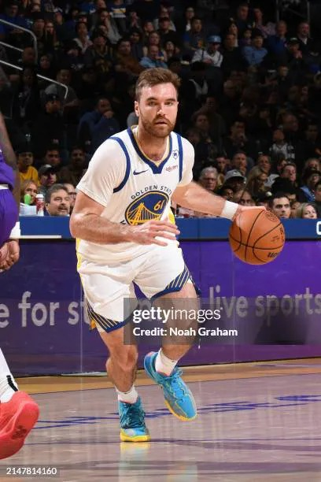

# Threads 貼文 DRyrXRQk_Ku

- 帳號: [@drchenghao](https://www.threads.com/@drchenghao)（程皓醫師｜好動人生。 運動與家庭醫學，已認證）
- 貼文 URL: https://www.threads.com/@drchenghao/post/DRyrXRQk_Ku
- 發文時間: 2025-12-03T14:49:20+08:00（UTC+8，時間戳 1764744560）
- 類型: photo
- 愛心數: 26
- 回覆數: 1
- 轉發數: 0
- 引用數: 0

## 貼文文字

原本抱持著零期待看勇士雷霆比賽
想不到看到開 zone 的 Spencer，
也至少讓比賽好看點😅

本日 Pat Spencer 
17分，6助，3板

久久沒上場的 Seth Curry 也打很好
7投6中，拿下14分

繼續等老大回來

## 圖片

- 原始圖片 URL: https://scontent-sin6-3.cdninstagram.com/v/t51.82787-15/589068344_17902542894446758_6784352249141853659_n.webp?efg=eyJ2ZW5jb2RlX3RhZyI6InRocmVhZHMuRkVFRC5pbWFnZV91cmxnZW4uNDA4LnNkci5yZWd1bGFyX3Bob3RvLmMyIn0&_nc_ht=scontent-sin6-3.cdninstagram.com&_nc_cat=110&_nc_oc=Q6cZ2gGUaiDPgquLGa8uyYxkH9nv5qIix8vo1aMh9QBjT4bYQ_dXPuSgAE54I4PyhnF2VAHODfOIziRUFNPDh12jXEin&_nc_ohc=wt0dQDbO7AIQ7kNvwExWiEV&_nc_gid=k5Eo01F93HtcYIak7qNFJA&edm=APs17CUBAAAA&ccb=7-5&ig_cache_key=Mzc3OTI3Mzc1MjM5Njk1MjIzOA%3D%3D.3-ccb7-5&oh=00_AQIlFR-VakZwC6XcbKZDeadGb5KV6DHuP4WAyo3Y4FehEg&oe=6AA5F2FB&_nc_sid=10d13b
- 尺寸: 408x612
