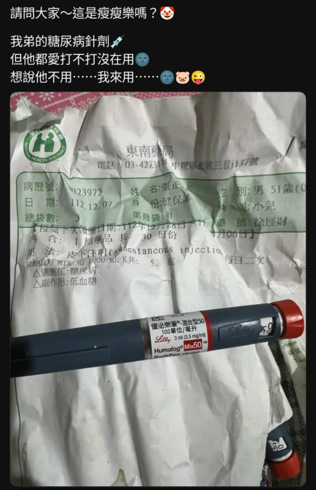

# Threads 貼文 DSBVQ4yk2qa

- 帳號: [@drchenghao](https://www.threads.com/@drchenghao)（程皓醫師｜好動人生。 運動與家庭醫學，已認證）
- 貼文 URL: https://www.threads.com/@drchenghao/post/DSBVQ4yk2qa
- 發文時間: 2025-12-09T07:24:50+08:00（UTC+8，時間戳 1765236290）
- 類型: photo
- 愛心數: 1095
- 回覆數: 106
- 轉發數: 26
- 引用數: 1
- 備註: 貼文曾被編輯

## 貼文文字

以後可能又有神奇故事了，
病人胰島素被當成瘦瘦針拿去給家人打，
結果低血糖送急診的故事...🫠

不過相信我的讀者應該不會發生這種事，
各位用藥之前，請務必與醫師諮詢呀❗

## 圖片

- 原始圖片 URL: https://scontent-sin6-3.cdninstagram.com/v/t51.82787-15/588955935_17904192366446758_5262705823673634124_n.webp?efg=eyJ2ZW5jb2RlX3RhZyI6InRocmVhZHMuRkVFRC5pbWFnZV91cmxnZW4uMTIyMC5zZHIucmVndWxhcl9waG90by5jMiJ9&_nc_ht=scontent-sin6-3.cdninstagram.com&_nc_cat=110&_nc_oc=Q6cZ2gH4fAn2QINtWMAvATn564LdeoCQIUWLWhTu2M3mnHEniL4FVn6adJVxNGK32akjcFP216Gpv5run8oRQ10qbiPA&_nc_ohc=FHQCO_J5ZvoQ7kNvwEhczPr&_nc_gid=r2ZNMT_twoVS7S45ixGJow&edm=APs17CUBAAAA&ccb=7-5&ig_cache_key=Mzc4MzM5ODY4MTQzNDM1MjI4Mg%3D%3D.3-ccb7-5&oh=00_AQIoYUZjCZyCH4h55g3f7TZmBVe7m_mBTpTt44Sk755F1w&oe=6AA5E306&_nc_sid=10d13b
- 尺寸: 1220x1892
