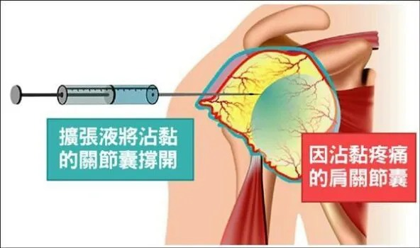

# Threads 貼文 DSHt6hHE01z

- 帳號: [@drchenghao](https://www.threads.com/@drchenghao)（程皓醫師｜好動人生。 運動與家庭醫學，已認證）
- 貼文 URL: https://www.threads.com/@drchenghao/post/DSHt6hHE01z
- 發文時間: 2025-12-11T18:55:41+08:00（UTC+8，時間戳 1765450541）
- 類型: photo
- 愛心數: 8
- 回覆數: 1
- 轉發數: 0
- 引用數: 0
- 備註: 此貼文為作者回覆自己的續文（self-thread），屬於同時發布的貼文群組 [DSHtAfwk4hm](https://www.threads.com/@drchenghao/post/DSHtAfwk4hm)

## 貼文文字

於肩關節內注射大量擴張液撐開空間

## 圖片

- 原始圖片 URL: https://scontent-sin6-3.cdninstagram.com/v/t51.82787-15/598601128_17904587880446758_3358474129024864229_n.webp?efg=eyJ2ZW5jb2RlX3RhZyI6InRocmVhZHMuRkVFRC5pbWFnZV91cmxnZW4uNTkyLnNkci5yZWd1bGFyX3Bob3RvLmMyIn0&_nc_ht=scontent-sin6-3.cdninstagram.com&_nc_cat=110&_nc_oc=Q6cZ2gH4fAn2QINtWMAvATn564LdeoCQIUWLWhTu2M3mnHEniL4FVn6adJVxNGK32akjcFP216Gpv5run8oRQ10qbiPA&_nc_ohc=tdxw20v8wdoQ7kNvwG3Na2x&_nc_gid=r2ZNMT_twoVS7S45ixGJow&edm=APs17CUBAAAA&ccb=7-5&ig_cache_key=Mzc4NTE5NTk0NTIwMzAyNzMxNQ%3D%3D.3-ccb7-5&oh=00_AQJPBSh9tlDTwrhonEIh-QbcbsvV2bWuI-Cvpw35ErWfwg&oe=6AA5D8B1&_nc_sid=10d13b
- 尺寸: 592x350
