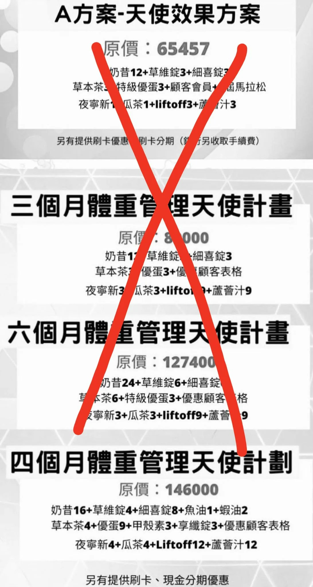

# Threads 貼文 DSKGDZ7E_KY

- 帳號: [@drchenghao](https://www.threads.com/@drchenghao)（程皓醫師｜好動人生。 運動與家庭醫學，已認證）
- 貼文 URL: https://www.threads.com/@drchenghao/post/DSKGDZ7E_KY
- 發文時間: 2025-12-12T17:05:05+08:00（UTC+8，時間戳 1765530305）
- 類型: photo
- 愛心數: 637
- 回覆數: 89
- 轉發數: 16
- 引用數: 2

## 貼文文字

有了猛健樂、胰妥讚、週纖達
未來不會再有智商稅的減重療程，
但絕對需要正確的營養及運動知識，
持續於治療過程輔助

其實這就是未來直銷的唯一出路，
拜託不要再想著攻擊瘦瘦針了，
不然你們真的會團滅

## 圖片

- 原始圖片 URL: https://scontent-sin6-3.cdninstagram.com/v/t51.82787-15/599267863_17904746055446758_776982854051079140_n.webp?efg=eyJ2ZW5jb2RlX3RhZyI6InRocmVhZHMuRkVFRC5pbWFnZV91cmxnZW4uMTA5Mi5zZHIucmVndWxhcl9waG90by5jMiJ9&_nc_ht=scontent-sin6-3.cdninstagram.com&_nc_cat=110&_nc_oc=Q6cZ2gH4fAn2QINtWMAvATn564LdeoCQIUWLWhTu2M3mnHEniL4FVn6adJVxNGK32akjcFP216Gpv5run8oRQ10qbiPA&_nc_ohc=DvVAqkdnf7EQ7kNvwFz7BQf&_nc_gid=r2ZNMT_twoVS7S45ixGJow&edm=APs17CUBAAAA&ccb=7-5&ig_cache_key=Mzc4NTg2NTA1OTAzMDUyODY2NA%3D%3D.3-ccb7-5&oh=00_AQKEswRhAogcRGMN2SnwuaMWPeH3L2pFvf1CziviGiz-nw&oe=6AA5CF9C&_nc_sid=10d13b
- 尺寸: 1092x2047
