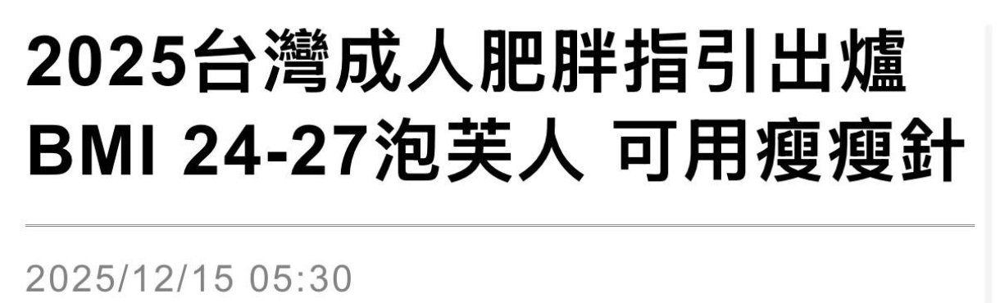

# Threads 貼文 DSRp5B5E8Vl

- 帳號: [@drchenghao](https://www.threads.com/@drchenghao)（程皓醫師｜好動人生。 運動與家庭醫學，已認證）
- 貼文 URL: https://www.threads.com/@drchenghao/post/DSRp5B5E8Vl
- 發文時間: 2025-12-15T15:32:56+08:00（UTC+8，時間戳 1765783976）
- 類型: photo
- 愛心數: 123
- 回覆數: 8
- 轉發數: 8
- 引用數: 7
- 備註: 貼文曾被編輯

## 貼文文字

2025 成人肥胖指引終於更新啦🔥

藥物，包括瘦瘦針，使用時機
➡️ BMI 27以上（有合併症），不需生活調整即可開始治療。
➡️ BMI 24-27（過重）且生活調整3-6個月無效者，可考慮使用。

且 GLP-1（瘦瘦針）建議要長期使用（6個月以上），非短期捷徑，並且搭配飲食控制及運動唷！

簡單講，有過重情形，用的好處遠大於壞處

後面看它到底有哪些好處👇

## 圖片

- 原始圖片 URL: https://scontent-sin6-3.cdninstagram.com/v/t51.82787-15/600616274_17905318554446758_754639596346680453_n.jpg?stp=dst-jpg_e35_tt6&efg=eyJ2ZW5jb2RlX3RhZyI6InRocmVhZHMuRkVFRC5pbWFnZV91cmxnZW4uMTIyMC5zZHIucmVndWxhcl9waG90by5jMiJ9&_nc_ht=scontent-sin6-3.cdninstagram.com&_nc_cat=110&_nc_oc=Q6cZ2gH4fAn2QINtWMAvATn564LdeoCQIUWLWhTu2M3mnHEniL4FVn6adJVxNGK32akjcFP216Gpv5run8oRQ10qbiPA&_nc_ohc=wPi4BRTFXtgQ7kNvwHx7vgc&_nc_gid=r2ZNMT_twoVS7S45ixGJow&edm=APs17CUBAAAA&ccb=7-5&ig_cache_key=Mzc4Nzk5MzAwMDU0Mzc2NTg2MQ%3D%3D.3-ccb7-5&oh=00_AQJ78Wn3-1cpqF9_KK7mYlM-SHHRhf3OLPBBQYcZIv51hQ&oe=6AA5DDA2&_nc_sid=10d13b
- 尺寸: 1220x370
