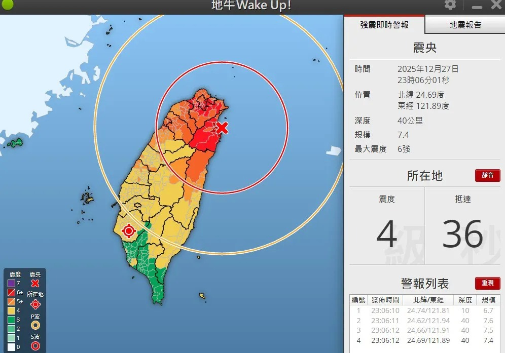

# Threads 貼文 DSxZWhvEwuq

- 帳號: [@drchenghao](https://www.threads.com/@drchenghao)（程皓醫師｜好動人生。 運動與家庭醫學，已認證）
- 貼文 URL: https://www.threads.com/@drchenghao/post/DSxZWhvEwuq
- 發文時間: 2025-12-27T23:24:06+08:00（UTC+8，時間戳 1766849046）
- 類型: photo
- 愛心數: 19
- 回覆數: 0
- 轉發數: 0
- 引用數: 0
- 備註: 此貼文為作者回覆自己的續文（self-thread），屬於同時發布的貼文群組 [DSxXoOVE2Wo](https://www.threads.com/@drchenghao/post/DSxXoOVE2Wo)

## 貼文文字

規模7.4，難怪那麼大...

## 圖片

- 原始圖片 URL: https://scontent-sin6-3.cdninstagram.com/v/t51.82787-15/606237720_17907400566446758_5472396561895891454_n.webp?efg=eyJ2ZW5jb2RlX3RhZyI6InRocmVhZHMuRkVFRC5pbWFnZV91cmxnZW4uOTk2LnNkci5yZWd1bGFyX3Bob3RvLmMyIn0&_nc_ht=scontent-sin6-3.cdninstagram.com&_nc_cat=110&_nc_oc=Q6cZ2gFOxdXXhA47Kjc5YTZtdZAk5i15po3lc9NDx5-OoDP_tBxfbOdORKsxo4GhwL68IdrMJPJ5tvddmlGXa4T0xBi5&_nc_ohc=JCfc9Ktj8CQQ7kNvwGxeq5q&_nc_gid=vKPqEweyoqjSaWM-B-hjiA&edm=APs17CUBAAAA&ccb=7-5&ig_cache_key=Mzc5NjkyNzQ2MDA2NDU2MjA5MA%3D%3D.3-ccb7-5&oh=00_AQK7tDGDvPbZem2GkPPDavuRu9uFc5Cbt0xew1Zu-4k5TQ&oe=6AA5ED71&_nc_sid=10d13b
- 尺寸: 996x697
