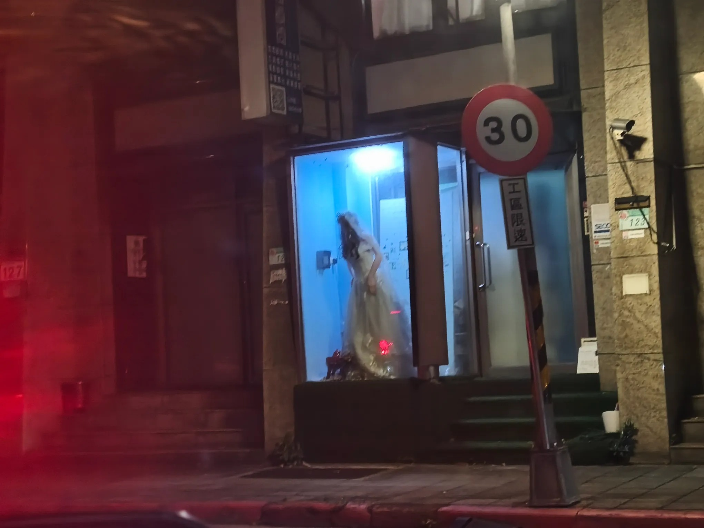

# Threads 貼文 DSzfK8Wk5zU

- 帳號: [@drchenghao](https://www.threads.com/@drchenghao)（程皓醫師｜好動人生。 運動與家庭醫學，已認證）
- 貼文 URL: https://www.threads.com/@drchenghao/post/DSzfK8Wk5zU
- 發文時間: 2025-12-28T18:53:26+08:00（UTC+8，時間戳 1766919206）
- 類型: photo
- 愛心數: 22
- 回覆數: 7
- 轉發數: 0
- 引用數: 0

## 貼文文字

每次經過環河北路三段的時候，都不敢往右看
怕會被這個嚇到，而且感覺它動了 😭
有人跟我一樣常常被它嚇到嗎 ？

（圖微可怕，慎入

## 圖片

- 原始圖片 URL: https://scontent-sin6-3.cdninstagram.com/v/t51.82787-15/606988561_17907534318446758_6020859240072635794_n.webp?efg=eyJ2ZW5jb2RlX3RhZyI6InRocmVhZHMuRkVFRC5pbWFnZV91cmxnZW4uMjA0MC5zZHIucmVndWxhcl9waG90by5jMiJ9&_nc_ht=scontent-sin6-3.cdninstagram.com&_nc_cat=110&_nc_oc=Q6cZ2gFOxdXXhA47Kjc5YTZtdZAk5i15po3lc9NDx5-OoDP_tBxfbOdORKsxo4GhwL68IdrMJPJ5tvddmlGXa4T0xBi5&_nc_ohc=o3ZBfx2TFXAQ7kNvwGK7RId&_nc_gid=vKPqEweyoqjSaWM-B-hjiA&edm=APs17CUBAAAA&ccb=7-5&ig_cache_key=Mzc5NzUxNjAwMjI0MzM1MzgxMg%3D%3D.3-ccb7-5&oh=00_AQLH2cI2iJtCAuYpdDoxyplIWp2n-SswDCL5jB9KM5TRLQ&oe=6AA5EEA7&_nc_sid=10d13b
- 尺寸: 2040x1530
