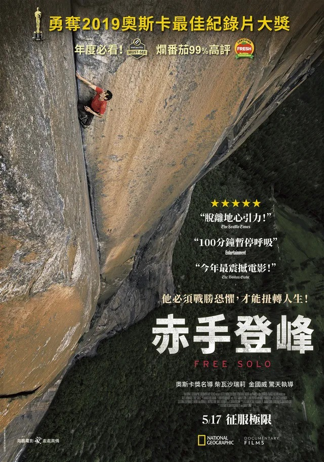

# Threads 貼文 DT21f9Tk-0X

- 帳號: [@drchenghao](https://www.threads.com/@drchenghao)（程皓醫師｜好動人生。 運動與家庭醫學，已認證）
- 貼文 URL: https://www.threads.com/@drchenghao/post/DT21f9Tk-0X
- 發文時間: 2026-01-23T22:37:39+08:00（UTC+8，時間戳 1769179059）
- 類型: photo
- 愛心數: 112
- 回覆數: 2
- 轉發數: 4
- 引用數: 0
- 備註: 貼文曾被編輯

## 貼文文字

Alex Honnold ，
死神的死對頭，號稱沒有杏仁核的男人

明天將要挑戰無保護獨攀101大樓，
並且將於 Netflix 直播，
老實說，已經期待幾個月了，
也將會是運動史上的創舉之一。

他最知名的紀錄是，2017年時，
完成史上首次對酋長岩的無保護獨攀，
難度其實遠比明天的101更高，
而該片，「赤手登峰」
於2018年榮獲奧斯卡最佳紀錄片獎，
有興趣的朋友可以趁今天看看，超神，
期待明天能夠創造另一個史詩級壯舉。

## 圖片

- 原始圖片 URL: https://scontent-sin6-3.cdninstagram.com/v/t51.82787-15/621648050_17912285163446758_6996660532938120634_n.webp?efg=eyJ2ZW5jb2RlX3RhZyI6InRocmVhZHMuRkVFRC5pbWFnZV91cmxnZW4uNjQwLnNkci5yZWd1bGFyX3Bob3RvLmMyIn0&_nc_ht=scontent-sin6-3.cdninstagram.com&_nc_cat=110&_nc_oc=Q6cZ2gGYzKNbtXjj9kQJSp8Sw53sYTSBnVBe7ptK9HSipX1sb9nPQz8YBQIq3LghVSlArtWuAC0d5WNpy9DNlgbR1BtR&_nc_ohc=EXVr4g6vPboQ7kNvwHj4lpc&_nc_gid=o4vZiAvxmuGvrppCaNjAVQ&edm=APs17CUBAAAA&ccb=7-5&ig_cache_key=MzgxNjQ3MzAyNjgzODY1NDIzMQ%3D%3D.3-ccb7-5&oh=00_AQJxUchBOzQWld3YZZGb6Mu8bzRgF9fVm2RcPF5Lljc7qw&oe=6AA5EC94&_nc_sid=10d13b
- 尺寸: 640x914
