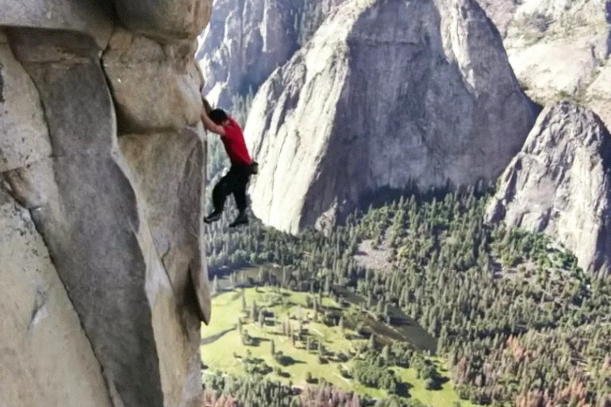

# Threads 貼文 DT40-msExK7

- 帳號: [@drchenghao](https://www.threads.com/@drchenghao)（程皓醫師｜好動人生。 運動與家庭醫學，已認證）
- 貼文 URL: https://www.threads.com/@drchenghao/post/DT40-msExK7
- 發文時間: 2026-01-24T17:11:35+08:00（UTC+8，時間戳 1769245895）
- 類型: photo
- 愛心數: 2655
- 回覆數: 34
- 轉發數: 77
- 引用數: 4

## 貼文文字

一直看到有人質疑 Alex Honnold，
為什麼要做這種自殺式的事情❓

他絕不是一心向死的人，相反，他一心求活
他從小不善表達，靠著攀岩找到自己，大學時，父母離異，他也開始全心投入攀岩

一心想死的人，絕對沒辦法成為偉大的攀岩家，就像其他人唱歌、跳舞、衝浪一樣

攀岩，就是他體現「生命的意義」的事情
你可以不認同不欣賞，但他的行為就像偉大的藝術品一樣，讓人震撼

## 圖片

- 原始圖片 URL: https://scontent-sin6-3.cdninstagram.com/v/t51.82787-15/622281501_17912426895446758_8126105535182570476_n.webp?efg=eyJ2ZW5jb2RlX3RhZyI6InRocmVhZHMuRkVFRC5pbWFnZV91cmxnZW4uMTIzMi5zZHIucmVndWxhcl9waG90by5jMiJ9&_nc_ht=scontent-sin6-3.cdninstagram.com&_nc_cat=110&_nc_oc=Q6cZ2gGYzKNbtXjj9kQJSp8Sw53sYTSBnVBe7ptK9HSipX1sb9nPQz8YBQIq3LghVSlArtWuAC0d5WNpy9DNlgbR1BtR&_nc_ohc=7R9pLPMXWOAQ7kNvwEVpWvF&_nc_gid=o4vZiAvxmuGvrppCaNjAVQ&edm=APs17CUBAAAA&ccb=7-5&ig_cache_key=MzgxNzAzMzY4NDc2NDI2NzE5NQ%3D%3D.3-ccb7-5&oh=00_AQI1GELiOY5LdgRAWdteEW-LBUba7AEi--q0bezpuQZdcA&oe=6AA5F8EB&_nc_sid=10d13b
- 尺寸: 1232x821
