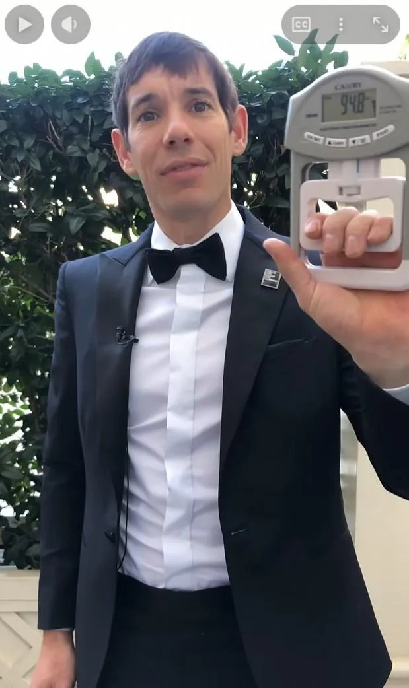

# Threads 貼文 DT4qZOtk4bP

- 帳號: [@drchenghao](https://www.threads.com/@drchenghao)（程皓醫師｜好動人生。 運動與家庭醫學，已認證）
- 貼文 URL: https://www.threads.com/@drchenghao/post/DT4qZOtk4bP
- 發文時間: 2026-01-24T15:39:06+08:00（UTC+8，時間戳 1769240346）
- 類型: photo
- 愛心數: 1331
- 回覆數: 88
- 轉發數: 11
- 引用數: 0

## 貼文文字

Alex，101 無保護獨攀挑戰延期至明天！
今天是門診，延到明天讓我也有機會看直播😁

簡單介紹一下，攀岩運動，
個人覺得，最能體現人體功能性的運動，
簡言之，放到野外，大概生存能力最強。

它同時需要考驗上下肢所有肌群及核心，
尤其上肢指力、握力、「拉力」，
同時也需要協調性及平衡，
甚至空間感知及培養專注度。
如果有機會，一定要讓小朋友嘗試攀岩。

而 Alex Honnold 就是其中最頂尖、
心臟也最大顆的那位。
期待明天🔥

附圖為他超人般的握力~

## 圖片

- 原始圖片 URL: https://scontent-sin6-3.cdninstagram.com/v/t51.82787-15/621597333_17912419191446758_5195364320849291122_n.webp?efg=eyJ2ZW5jb2RlX3RhZyI6InRocmVhZHMuRkVFRC5pbWFnZV91cmxnZW4uNjE5LnNkci5yZWd1bGFyX3Bob3RvLmMyIn0&_nc_ht=scontent-sin6-3.cdninstagram.com&_nc_cat=110&_nc_oc=Q6cZ2gGYzKNbtXjj9kQJSp8Sw53sYTSBnVBe7ptK9HSipX1sb9nPQz8YBQIq3LghVSlArtWuAC0d5WNpy9DNlgbR1BtR&_nc_ohc=FjFav0QKUe0Q7kNvwH5a6Y8&_nc_gid=o4vZiAvxmuGvrppCaNjAVQ&edm=APs17CUBAAAA&ccb=7-5&ig_cache_key=MzgxNjk4NzEzNTkzMzkwODY4Nw%3D%3D.3-ccb7-5&oh=00_AQKyrWSh2mul0j3Qi7ZL7MEnaWpmYs74alG0-ef4zw-x6w&oe=6AA5E9FB&_nc_sid=10d13b
- 尺寸: 619x1042
