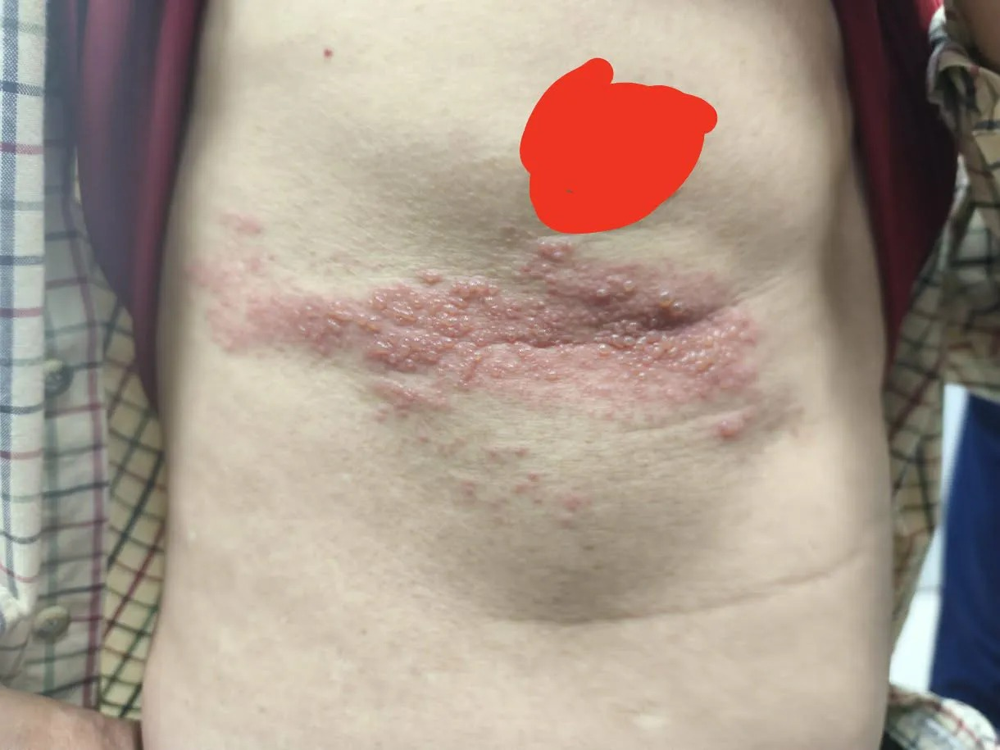

# Threads 貼文 DTAa1VxE4v3

- 帳號: [@drchenghao](https://www.threads.com/@drchenghao)（程皓醫師｜好動人生。 運動與家庭醫學，已認證）
- 貼文 URL: https://www.threads.com/@drchenghao/post/DTAa1VxE4v3
- 發文時間: 2026-01-02T19:25:39+08:00（UTC+8，時間戳 1767353139）
- 類型: photo
- 愛心數: 56
- 回覆數: 3
- 轉發數: 0
- 引用數: 0

## 貼文文字

前幾天有位來看減重的朋友，
回診說有腹痛狀況，
原本以為是腹脹導致，
但這位朋友說他是沿著肋骨下痛一片，
立馬懷疑 ”帶狀皰疹”！！

果然被我逮到 😂
後續開立抗病毒藥並追蹤，
隔週也改善許多

目前聯新也有提供帶狀皰疹疫苗，
有需要的朋友也可以來諮詢🔥

## 圖片

- 原始圖片 URL: https://scontent-sin6-3.cdninstagram.com/v/t51.82787-15/609663060_17908558893446758_7321947095710190072_n.webp?efg=eyJ2ZW5jb2RlX3RhZyI6InRocmVhZHMuRkVFRC5pbWFnZV91cmxnZW4uMTIyMC5zZHIucmVndWxhcl9waG90by5jMiJ9&_nc_ht=scontent-sin6-3.cdninstagram.com&_nc_cat=110&_nc_oc=Q6cZ2gGuE-Kq3b4biEOxQBqY8HPAuZnduHVP3sWQrlY2yCAjvyVohBUWJcPAZrKAu_uu1GdA93HqrpRFgyiyrPFIdgwT&_nc_ohc=h83B1-lZlbsQ7kNvwG4YUQF&_nc_gid=pi00JZNY5mLpy24aR0YrrQ&edm=APs17CUBAAAA&ccb=7-5&ig_cache_key=MzgwMTE1NjEwMDIxNDE5NzIzOQ%3D%3D.3-ccb7-5&oh=00_AQJRxDxHNEaU8-sm1t3nDdcAQSSbULP68b2BdJ_FEK-zFg&oe=6AA600EE&_nc_sid=10d13b
- 尺寸: 1220x915
