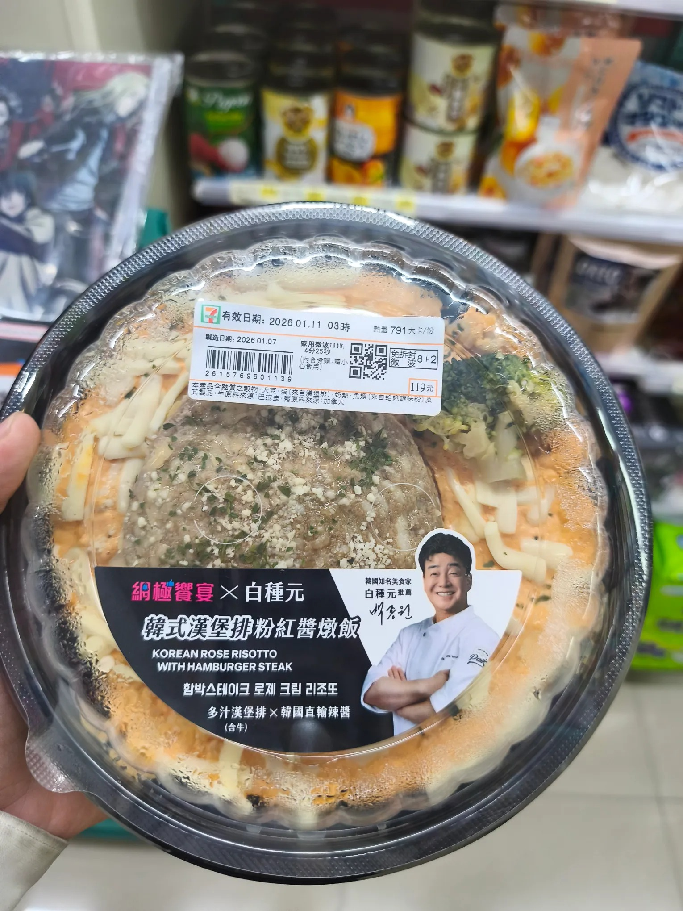

# Threads 貼文 DTUiFLXk_lt

- 帳號: [@drchenghao](https://www.threads.com/@drchenghao)（程皓醫師｜好動人生。 運動與家庭醫學，已認證）
- 貼文 URL: https://www.threads.com/@drchenghao/post/DTUiFLXk_lt
- 發文時間: 2026-01-10T14:53:48+08:00（UTC+8，時間戳 1768028028）
- 類型: photo
- 愛心數: 42
- 回覆數: 6
- 轉發數: 0
- 引用數: 0
- 備註: 貼文曾被編輯

## 貼文文字

週六診，戰鬥至 2點終於下診
來朝聖黑白大廚聯名的漢堡排燉飯
不專業評價，燉飯偏甜辣，味道當然稍微重鹹
漢堡排普通，速食店漢堡肉的味道

嗯...結論是有吃過就好😅
當然，減重吃這個可是不建議的唷 xD

## 圖片

- 原始圖片 URL: https://scontent-sin6-3.cdninstagram.com/v/t51.82787-15/612503332_17909949573446758_6297256875598378857_n.webp?efg=eyJ2ZW5jb2RlX3RhZyI6InRocmVhZHMuRkVFRC5pbWFnZV91cmxnZW4uMTUzMC5zZHIucmVndWxhcl9waG90by5jMiJ9&_nc_ht=scontent-sin6-3.cdninstagram.com&_nc_cat=110&_nc_oc=Q6cZ2gGuE-Kq3b4biEOxQBqY8HPAuZnduHVP3sWQrlY2yCAjvyVohBUWJcPAZrKAu_uu1GdA93HqrpRFgyiyrPFIdgwT&_nc_ohc=tXHg0JpjMsoQ7kNvwEf5ezz&_nc_gid=pi00JZNY5mLpy24aR0YrrQ&edm=APs17CUBAAAA&ccb=7-5&ig_cache_key=MzgwNjgxNzQ3NDQyMDQwNjYzNw%3D%3D.3-ccb7-5&oh=00_AQIaqItYmLuyO4vx9xvZyMcQypZ2OhEy8Pgxr8s3zaU2rg&oe=6AA5CFC9&_nc_sid=10d13b
- 尺寸: 1530x2040
