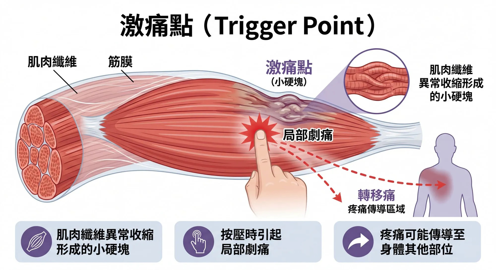

# Threads 貼文 DTz86qdkxrV

- 帳號: [@drchenghao](https://www.threads.com/@drchenghao)（程皓醫師｜好動人生。 運動與家庭醫學，已認證）
- 貼文 URL: https://www.threads.com/@drchenghao/post/DTz86qdkxrV
- 發文時間: 2026-01-22T19:44:45+08:00（UTC+8，時間戳 1769082285）
- 類型: photo
- 愛心數: 17
- 回覆數: 0
- 轉發數: 0
- 引用數: 0
- 備註: 此貼文為作者回覆自己的續文（self-thread），屬於同時發布的貼文群組 [DTz8m1pEwjc](https://www.threads.com/@drchenghao/post/DTz8m1pEwjc)

## 貼文文字

激痛點，
讓各位看一看到底是什麼

## 圖片

- 原始圖片 URL: https://scontent-sin6-3.cdninstagram.com/v/t51.82787-15/621226939_17912071908446758_5040276372380681746_n.webp?efg=eyJ2ZW5jb2RlX3RhZyI6InRocmVhZHMuRkVFRC5pbWFnZV91cmxnZW4uMjAwMC5zZHIucmVndWxhcl9waG90by5jMiJ9&_nc_ht=scontent-sin6-3.cdninstagram.com&_nc_cat=110&_nc_oc=Q6cZ2gGYzKNbtXjj9kQJSp8Sw53sYTSBnVBe7ptK9HSipX1sb9nPQz8YBQIq3LghVSlArtWuAC0d5WNpy9DNlgbR1BtR&_nc_ohc=MhcDzXjnB7UQ7kNvwGAUapz&_nc_gid=o4vZiAvxmuGvrppCaNjAVQ&edm=APs17CUBAAAA&ccb=7-5&ig_cache_key=MzgxNTY2MTIyMzQyNjU5NTU0MQ%3D%3D.3-ccb7-5&oh=00_AQI4qK5MZ75xJP19K0tsIA6sv9yinJu77h__QtoZVajd3g&oe=6AA5EAB2&_nc_sid=10d13b
- 尺寸: 2000x1091
