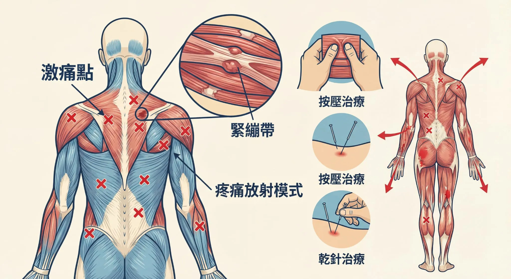

# Threads 貼文 DTz8m1pEwjc

- 帳號: [@drchenghao](https://www.threads.com/@drchenghao)（程皓醫師｜好動人生。 運動與家庭醫學，已認證）
- 貼文 URL: https://www.threads.com/@drchenghao/post/DTz8m1pEwjc
- 發文時間: 2026-01-22T19:42:02+08:00（UTC+8，時間戳 1769082122）
- 類型: photo
- 愛心數: 38
- 回覆數: 6
- 轉發數: 0
- 引用數: 0
- 備註: 貼文曾被編輯

## 貼文文字

❗疼痛小知識，痛哪打哪❗
痛哪，針打哪，其實是有根據的
叫 「激痛點治療」（Trigger point injections)
而中醫會叫它「氣結」治療

大家肩頸痛時一定曾有這種經驗，
通常會有類似結塊的點，
按壓會明顯疼痛，
而此時，只要定位好，針下去，
肌肉跳完就能改善了❗

不管是針灸、乾針、或注射都很有效
而這就是「激痛點治療」，
也是我門診的一大利器唷🔥

留言告訴我你是否有類似的疼痛點👇

## 圖片

- 原始圖片 URL: https://scontent-sin6-3.cdninstagram.com/v/t51.82787-15/619958516_17912071659446758_6939174355868288622_n.webp?efg=eyJ2ZW5jb2RlX3RhZyI6InRocmVhZHMuRkVFRC5pbWFnZV91cmxnZW4uMjA0OC5zZHIucmVndWxhcl9waG90by5jMiJ9&_nc_ht=scontent-sin6-3.cdninstagram.com&_nc_cat=110&_nc_oc=Q6cZ2gGYzKNbtXjj9kQJSp8Sw53sYTSBnVBe7ptK9HSipX1sb9nPQz8YBQIq3LghVSlArtWuAC0d5WNpy9DNlgbR1BtR&_nc_ohc=r1BnOYU5MDkQ7kNvwGE7rqO&_nc_gid=o4vZiAvxmuGvrppCaNjAVQ&edm=APs17CUBAAAA&ccb=7-5&ig_cache_key=MzgxNTY1OTg2MTA0MTE1NDI2OA%3D%3D.3-ccb7-5&oh=00_AQJDGc0Zf0k82X6O0RB3qxA2afE61k3jjOuI6e1EDY2Lkw&oe=6AA5E254&_nc_sid=10d13b
- 尺寸: 2048x1117
