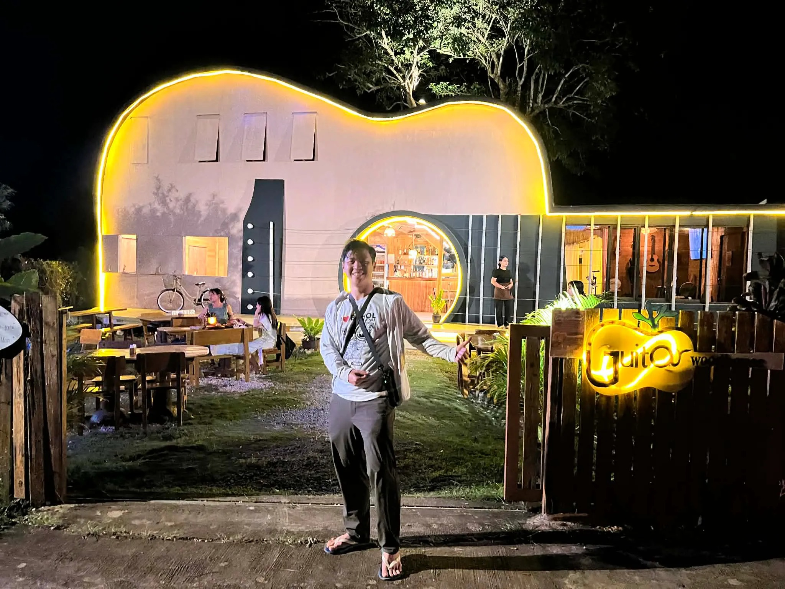

# Threads 貼文 DU-Y3clk3_q

- 帳號: [@drchenghao](https://www.threads.com/@drchenghao)（程皓醫師｜好動人生。 運動與家庭醫學，已認證）
- 貼文 URL: https://www.threads.com/@drchenghao/post/DU-Y3clk3_q
- 發文時間: 2026-02-20T17:32:47+08:00（UTC+8，時間戳 1771579967）
- 類型: photo
- 愛心數: 24
- 回覆數: 11
- 轉發數: 1
- 引用數: 0

## 貼文文字

這次宿霧行，從 kkday 上訂了幾次包車行程
包括以下幾項，
奧斯陸鯨鯊半日遊，9分
宿霧市區10小時包車，9.5分
薄荷島8小時包車，7分

結論，滿意
不僅價格相對算平實，服務好，除薄荷島司機稍微有點兩光外，其他都很好，若真的有很滿意的司機還能留下聯絡方式，之後再請他幫忙

kkday 真的是自由行神器，
推薦給要去宿霧的朋友可用用~

## 圖片

- 原始圖片 URL: https://scontent-sin6-3.cdninstagram.com/v/t51.82787-15/639747975_17919434106446758_8556913826688447962_n.webp?efg=eyJ2ZW5jb2RlX3RhZyI6InRocmVhZHMuRkVFRC5pbWFnZV91cmxnZW4uMjA0OC5zZHIucmVndWxhcl9waG90by5jMiJ9&_nc_ht=scontent-sin6-3.cdninstagram.com&_nc_cat=110&_nc_oc=Q6cZ2gHzg1e_HvGH9Cm3HnKx_ZVLOvsX68lq3UJ8pZ-LOqEy-Il54AU7zDRjv5jL_PYOts8olWWnpL1fPgdEyK1hPAKg&_nc_ohc=5Zg8kuRM6Z0Q7kNvwEMP9Uy&_nc_gid=nqS3ED0xIt6Ps4Ph523MCw&edm=APs17CUBAAAA&ccb=7-5&ig_cache_key=MzgzNjYxMzI5NTk0ODkyMjg1OA%3D%3D.3-ccb7-5&oh=00_AQKCACRuf5e1frrwZS2-GZgcCtwSPhRPqDzjcWbicnLS7g&oe=6AA5ED47&_nc_sid=10d13b
- 尺寸: 2048x1536
