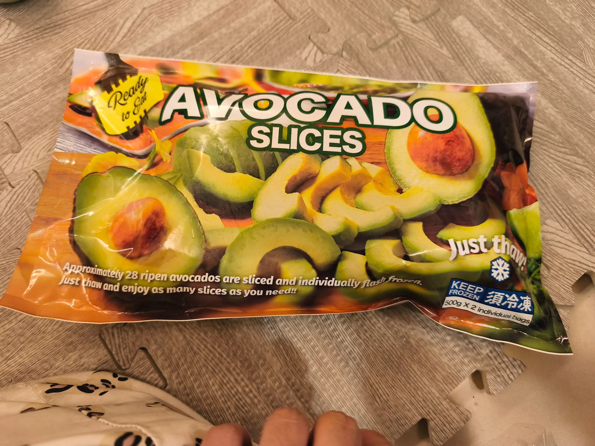

# Threads 貼文 DUDgWmcEzl7

- 帳號: [@drchenghao](https://www.threads.com/@drchenghao)（程皓醫師｜好動人生。 運動與家庭醫學，已認證）
- 貼文 URL: https://www.threads.com/@drchenghao/post/DUDgWmcEzl7
- 發文時間: 2026-01-28T20:43:00+08:00（UTC+8，時間戳 1769604180）
- 類型: photo
- 愛心數: 23
- 回覆數: 3
- 轉發數: 1
- 引用數: 0
- 備註: 貼文曾被編輯

## 貼文文字

最近很常吃酪梨切片當點心，

小朋友也常常一起吃

酪梨營養價值超高，
非常優質的脂肪酸來源，
優質維生素ABE 來源，
同時也有降膽固醇效果，
重要是適當搭配還不錯吃

推薦給大家，飲控好幫手，
底下看它的營養價值👇

## 圖片

- 原始圖片 URL: https://scontent-sin6-3.cdninstagram.com/v/t51.82787-15/622575520_17913265092446758_5316459949621047924_n.webp?efg=eyJ2ZW5jb2RlX3RhZyI6InRocmVhZHMuRkVFRC5pbWFnZV91cmxnZW4uMjA0MC5zZHIucmVndWxhcl9waG90by5jMiJ9&_nc_ht=scontent-sin6-3.cdninstagram.com&_nc_cat=110&_nc_oc=Q6cZ2gH6ZX5hEHIjYogI66dQrfcO0fkaFy2gABb9-mpNqhWpl5e1ZVKmwOARyrSSM4BbpptET7Y7tI1G8R99_FvY1UuA&_nc_ohc=CsgOBNicLysQ7kNvwH4DADZ&_nc_gid=YBNbB5L6QxEh4_5TUJdIhQ&edm=APs17CUBAAAA&ccb=7-5&ig_cache_key=MzgyMDAzOTE5OTUzMDM2NzM1NQ%3D%3D.3-ccb7-5&oh=00_AQJMM1EKNCpDoWgnxZdKeB_YheznSqWtIFqsVsmDp6zpAg&oe=6AA5D9ED&_nc_sid=10d13b
- 尺寸: 2040x1530
