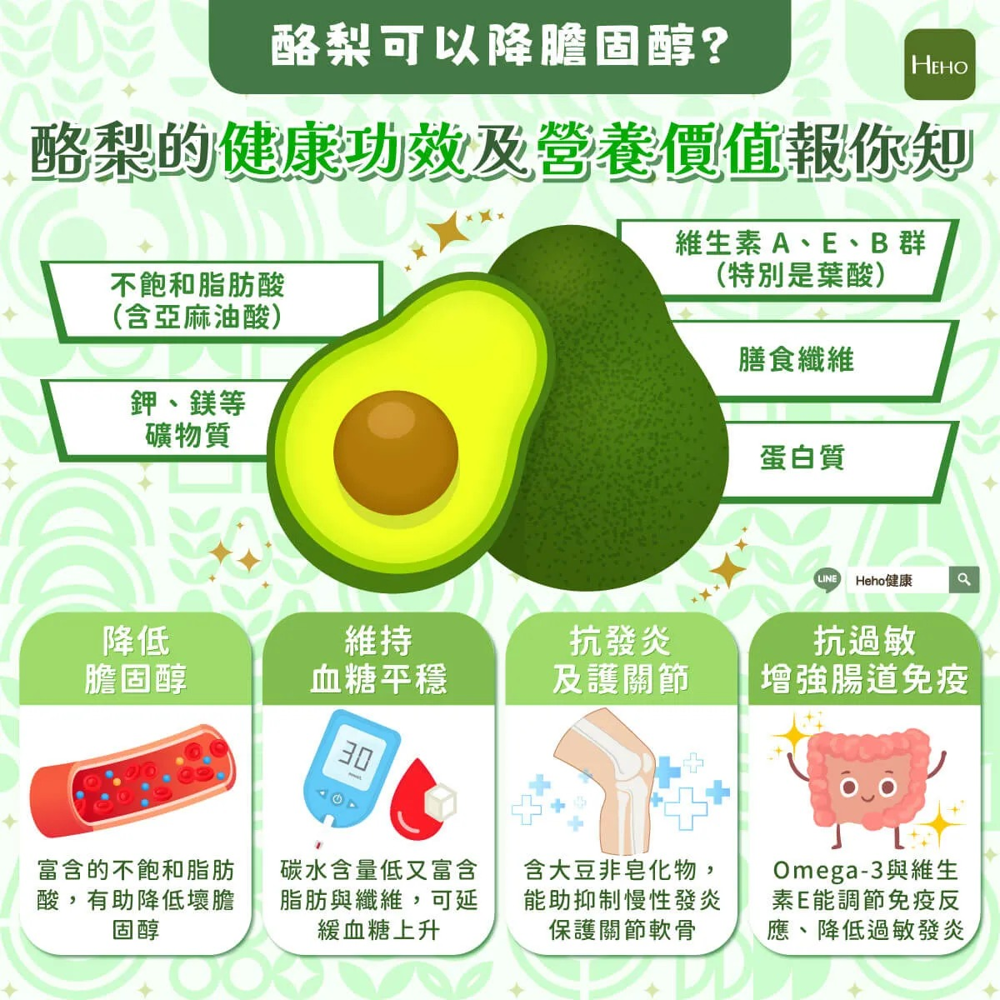

# Threads 貼文 DUDgcHWE1dd

- 帳號: [@drchenghao](https://www.threads.com/@drchenghao)（程皓醫師｜好動人生。 運動與家庭醫學，已認證）
- 貼文 URL: https://www.threads.com/@drchenghao/post/DUDgcHWE1dd
- 發文時間: 2026-01-28T20:43:45+08:00（UTC+8，時間戳 1769604225）
- 類型: photo
- 愛心數: 7
- 回覆數: 0
- 轉發數: 0
- 引用數: 0
- 備註: 此貼文為作者回覆自己的續文（self-thread），屬於同時發布的貼文群組 [DUDgWmcEzl7](https://www.threads.com/@drchenghao/post/DUDgWmcEzl7)

## 貼文文字

優質不飽和脂肪酸，
對於心血管等等都有幫助

## 圖片

- 原始圖片 URL: https://scontent-sin6-3.cdninstagram.com/v/t51.82787-15/623936486_17913266070446758_74880779486557587_n.webp?efg=eyJ2ZW5jb2RlX3RhZyI6InRocmVhZHMuRkVFRC5pbWFnZV91cmxnZW4uMTIwMC5zZHIucmVndWxhcl9waG90by5jMiJ9&_nc_ht=scontent-sin6-3.cdninstagram.com&_nc_cat=110&_nc_oc=Q6cZ2gH6ZX5hEHIjYogI66dQrfcO0fkaFy2gABb9-mpNqhWpl5e1ZVKmwOARyrSSM4BbpptET7Y7tI1G8R99_FvY1UuA&_nc_ohc=_xPmEKmk4OkQ7kNvwHuMgqe&_nc_gid=YBNbB5L6QxEh4_5TUJdIhQ&edm=APs17CUBAAAA&ccb=7-5&ig_cache_key=MzgyMDAzOTU3ODQ2MDU3NTU4MQ%3D%3D.3-ccb7-5&oh=00_AQKlElpLEAUdjbM1vqzimuEyu9TYd2QhnwUDP-9DdbH0HQ&oe=6AA5DC6E&_nc_sid=10d13b
- 尺寸: 1200x1200
