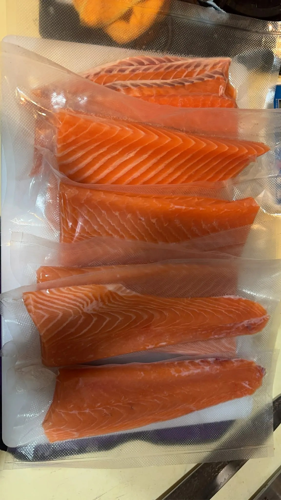

# Threads 貼文 DUVYsKJE5Ax

- 帳號: [@drchenghao](https://www.threads.com/@drchenghao)（程皓醫師｜好動人生。 運動與家庭醫學，已認證）
- 貼文 URL: https://www.threads.com/@drchenghao/post/DUVYsKJE5Ax
- 發文時間: 2026-02-04T19:22:22+08:00（UTC+8，時間戳 1770204142）
- 類型: photo
- 愛心數: 41
- 回覆數: 7
- 轉發數: 0
- 引用數: 0
- 備註: 貼文曾被編輯

## 貼文文字

［減脂飲食推薦，生魚片］
最近是鮭魚富翁，
鮭魚是超優質的蛋白質及不飽和脂肪酸來源，
天然的魚油 DHA、EPA ，心血管有幫助
減重或是健身減脂期食用非常棒❗

且生魚片也能最大保留營養，
推薦給大家吃起來❗❗

## 圖片

- 原始圖片 URL: https://scontent-sin6-3.cdninstagram.com/v/t51.82787-15/626619085_17914863063446758_982399941570546860_n.webp?efg=eyJ2ZW5jb2RlX3RhZyI6InRocmVhZHMuRkVFRC5pbWFnZV91cmxnZW4uMTE1Mi5zZHIucmVndWxhcl9waG90by5jMiJ9&_nc_ht=scontent-sin6-3.cdninstagram.com&_nc_cat=110&_nc_oc=Q6cZ2gH6ZX5hEHIjYogI66dQrfcO0fkaFy2gABb9-mpNqhWpl5e1ZVKmwOARyrSSM4BbpptET7Y7tI1G8R99_FvY1UuA&_nc_ohc=_kdU5U3ql94Q7kNvwG4kAfV&_nc_gid=YBNbB5L6QxEh4_5TUJdIhQ&edm=APs17CUBAAAA&ccb=7-5&ig_cache_key=MzgyNTA3MjA0NjE4NDA0MjU0NQ%3D%3D.3-ccb7-5&oh=00_AQKl41R6jOvpuLII9DY8Y5GH0hrB1lWXDieDp-lSFwm2zw&oe=6AA5DD97&_nc_sid=10d13b
- 尺寸: 1152x2048
