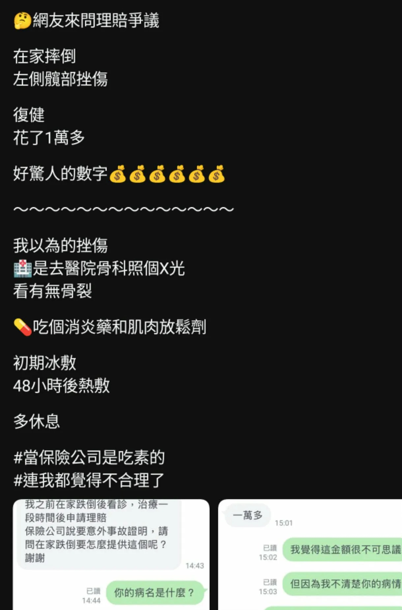

# Threads 貼文 DUYES4uE7yk

- 帳號: [@drchenghao](https://www.threads.com/@drchenghao)（程皓醫師｜好動人生。 運動與家庭醫學，已認證）
- 貼文 URL: https://www.threads.com/@drchenghao/post/DUYES4uE7yk
- 發文時間: 2026-02-05T20:21:53+08:00（UTC+8，時間戳 1770294113）
- 類型: photo
- 愛心數: 18
- 回覆數: 2
- 轉發數: 0
- 引用數: 0

## 貼文文字

挫傷從來都不簡單，
各種各樣的挫傷，從皮下脂肪、肌肉、肌腱、韌帶、骨頭、神經，都有可能受傷，而有些人一輩子都在處理這些意外的後遺症。

而買意外險，就是為了這種時候需要，
因此我也有買，以備不時之需。

## 圖片

- 原始圖片 URL: https://scontent-sin6-3.cdninstagram.com/v/t51.82787-15/627373277_17915059695446758_1875977114958823973_n.webp?efg=eyJ2ZW5jb2RlX3RhZyI6InRocmVhZHMuRkVFRC5pbWFnZV91cmxnZW4uMTIyMC5zZHIucmVndWxhcl9waG90by5jMiJ9&_nc_ht=scontent-sin6-3.cdninstagram.com&_nc_cat=110&_nc_oc=Q6cZ2gHTVxoc2tu2n2OZDg-ALEXBldtRpBYWBE61ktzUVNr3e-HnLzhMR3a5TPztJ1Qt6ahuZVGLXOgz3Oc8qma14Ipg&_nc_ohc=F-5JsUuTPdwQ7kNvwHU08Zy&_nc_gid=SySvvl7t13JwtklL8lwkXg&edm=APs17CUBAAAA&ccb=7-5&ig_cache_key=MzgyNTgyNjc3MzQ5MDQ0OTU3Mg%3D%3D.3-ccb7-5&oh=00_AQJcT6MUiGr3fKlJbrcKG3f-2NN0FCy1VkwNbW8iKu4zCw&oe=6AA5D358&_nc_sid=10d13b
- 尺寸: 1220x1850
