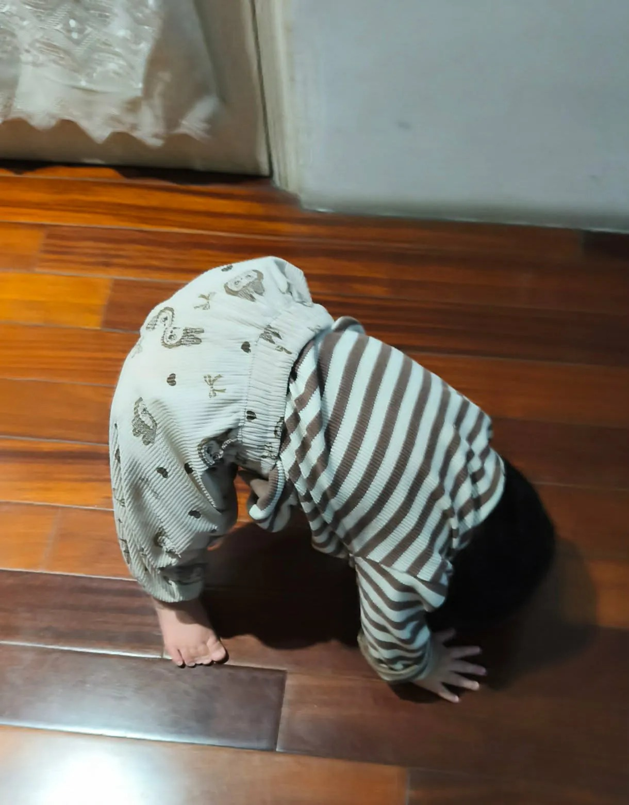
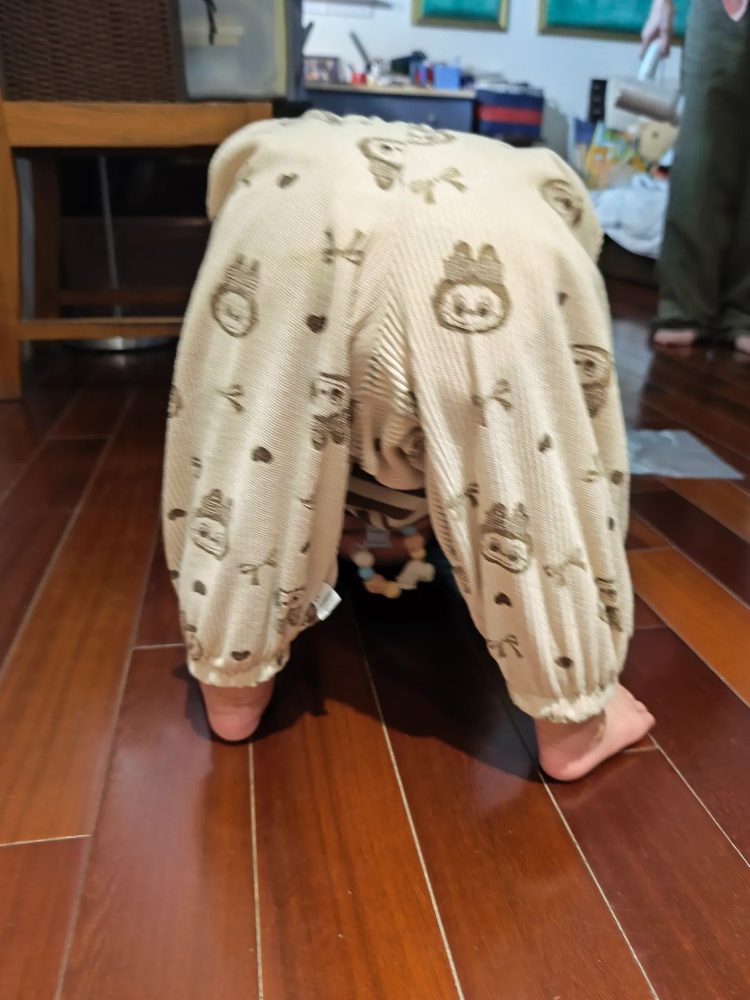

# Threads 貼文 DUktqiLk0pg

- 帳號: [@drchenghao](https://www.threads.com/@drchenghao)（程皓醫師｜好動人生。 運動與家庭醫學，已認證）
- 貼文 URL: https://www.threads.com/@drchenghao/post/DUktqiLk0pg
- 發文時間: 2026-02-10T18:14:16+08:00（UTC+8，時間戳 1770718456）
- 類型: carousel
- 愛心數: 57
- 回覆數: 24
- 轉發數: 2
- 引用數: 0

## 貼文文字

好動的1歲妹妹突然學會的可愛新動作，
從底下看她還會呵呵笑，
感覺不久就能練成前滾翻

大家有推薦的幼兒體操嗎，
之後可以送她去放放電 😂

## 圖片

- 原始圖片 URL: https://scontent-sin6-3.cdninstagram.com/v/t51.82787-15/629910458_17916229809446758_8659384342914351223_n.webp?efg=eyJ2ZW5jb2RlX3RhZyI6InRocmVhZHMuQ0FST1VTRUxfSVRFTS5pbWFnZV91cmxnZW4uMTIyMC5zZHIucmVndWxhcl9waG90by5jMiJ9&_nc_ht=scontent-sin6-3.cdninstagram.com&_nc_cat=110&_nc_oc=Q6cZ2gHTVxoc2tu2n2OZDg-ALEXBldtRpBYWBE61ktzUVNr3e-HnLzhMR3a5TPztJ1Qt6ahuZVGLXOgz3Oc8qma14Ipg&_nc_ohc=oXdUiPZFPqYQ7kNvwFcuGjC&_nc_gid=SySvvl7t13JwtklL8lwkXg&edm=APs17CUBAAAA&ccb=7-5&ig_cache_key=MzgyOTM4MzkyMzkwNzEwNzA4Nw%3D%3D.3-ccb7-5&oh=00_AQLOBo3J5f2RvLQwFs4Xuhebyk0JPpzrEnGzSfMjqMg6EQ&oe=6AA5CEBA&_nc_sid=10d13b
- 尺寸: 1220x1559

- 原始圖片 URL: https://scontent-sin6-3.cdninstagram.com/v/t51.82787-15/632468988_17916229800446758_5150860631196591557_n.webp?efg=eyJ2ZW5jb2RlX3RhZyI6InRocmVhZHMuQ0FST1VTRUxfSVRFTS5pbWFnZV91cmxnZW4uMTUzMC5zZHIucmVndWxhcl9waG90by5jMiJ9&_nc_ht=scontent-sin6-3.cdninstagram.com&_nc_cat=110&_nc_oc=Q6cZ2gHTVxoc2tu2n2OZDg-ALEXBldtRpBYWBE61ktzUVNr3e-HnLzhMR3a5TPztJ1Qt6ahuZVGLXOgz3Oc8qma14Ipg&_nc_ohc=pFwteljy5tUQ7kNvwFzPTRv&_nc_gid=SySvvl7t13JwtklL8lwkXg&edm=APs17CUBAAAA&ccb=7-5&ig_cache_key=MzgyOTM4MzkyMzQ3MDkxODE0NQ%3D%3D.3-ccb7-5&oh=00_AQIeKRK0y8rfCa53XQZsam0WK7c2ObBhvQ2rLvQYgXoqCQ&oe=6AA5CD72&_nc_sid=10d13b
- 尺寸: 1530x2040
