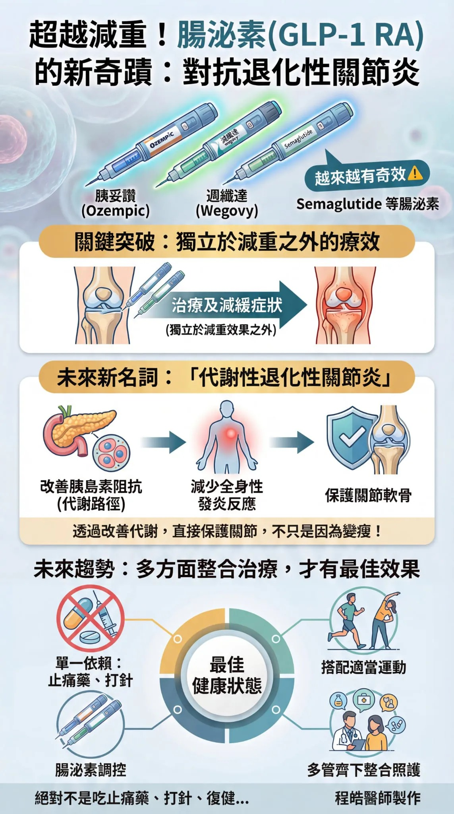

# Threads 貼文 DUnXmP6k79C

- 帳號: [@drchenghao](https://www.threads.com/@drchenghao)（程皓醫師｜好動人生。 運動與家庭醫學，已認證）
- 貼文 URL: https://www.threads.com/@drchenghao/post/DUnXmP6k79C
- 發文時間: 2026-02-11T18:59:09+08:00（UTC+8，時間戳 1770807549）
- 類型: photo
- 愛心數: 56
- 回覆數: 7
- 轉發數: 0
- 引用數: 3
- 備註: 貼文曾被編輯

## 貼文文字

❗胰妥讚、週纖達，semaglutide 
等腸泌素，減重外越來越有奇效❗

它們除減重外，未來可能同時能治療及減緩退化性關節炎症狀（獨立於減重效果之外）

「代謝性退化性關節炎」
會是未來的新名詞，透過改善胰島素阻抗等代謝路徑，減少全身性發炎反應，保護關節軟骨。

未來退化性關節炎，需要的是多方面整合的治療，絕對不是只吃止痛藥、打針、復健
而是多管齊下，搭配適當運動，才有最佳效果。 

留言看更多文章👇

## 圖片

- 原始圖片 URL: https://scontent-sin6-3.cdninstagram.com/v/t51.82787-15/632425987_17916497877446758_4989250506279580040_n.webp?efg=eyJ2ZW5jb2RlX3RhZyI6InRocmVhZHMuRkVFRC5pbWFnZV91cmxnZW4uMTE0My5zZHIucmVndWxhcl9waG90by5jMiJ9&_nc_ht=scontent-sin6-3.cdninstagram.com&_nc_cat=110&_nc_oc=Q6cZ2gHTVxoc2tu2n2OZDg-ALEXBldtRpBYWBE61ktzUVNr3e-HnLzhMR3a5TPztJ1Qt6ahuZVGLXOgz3Oc8qma14Ipg&_nc_ohc=iCchERUoDkEQ7kNvwH5f5HX&_nc_gid=SySvvl7t13JwtklL8lwkXg&edm=APs17CUBAAAA&ccb=7-5&ig_cache_key=MzgzMDEzMzc5MTYwMDY1NjE5NA%3D%3D.3-ccb7-5&oh=00_AQJVYXYC0Csc77RXOX4fR7CvBc3ZjJGRdsFAiC2MdTZj2w&oe=6AA5DEE1&_nc_sid=10d13b
- 尺寸: 1143x2048
