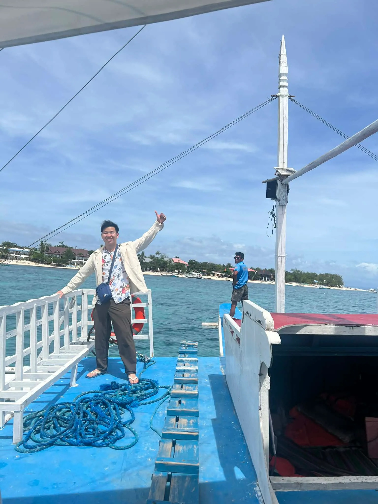
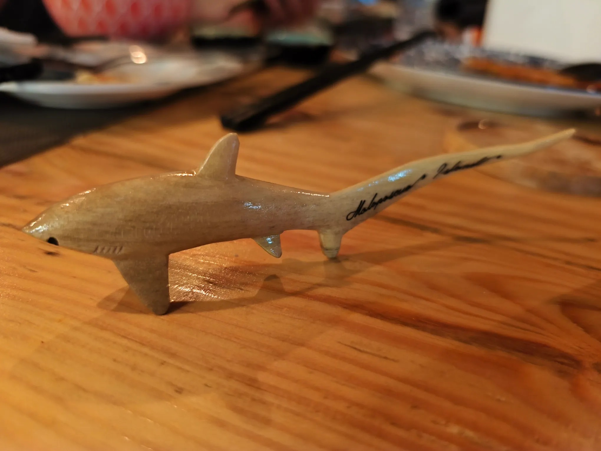

# Threads 貼文 DUx2jyPEzd_

- 帳號: [@drchenghao](https://www.threads.com/@drchenghao)（程皓醫師｜好動人生。 運動與家庭醫學，已認證）
- 貼文 URL: https://www.threads.com/@drchenghao/post/DUx2jyPEzd_
- 發文時間: 2026-02-15T20:42:06+08:00（UTC+8，時間戳 1771159326）
- 類型: carousel
- 愛心數: 35
- 回覆數: 3
- 轉發數: 0
- 引用數: 0

## 貼文文字

包船前往宿霧媽媽島，期待明天看長尾鯊

媽媽島（Malapascua），目前世界上唯一一個可以每天看到長尾鯊的地方，也被譽為長尾鯊的故鄉

## 圖片

- 原始圖片 URL: https://scontent-sin6-3.cdninstagram.com/v/t51.82787-15/635402655_17917805175446758_5355810117234193062_n.webp?efg=eyJ2ZW5jb2RlX3RhZyI6InRocmVhZHMuQ0FST1VTRUxfSVRFTS5pbWFnZV91cmxnZW4uMTUzNi5zZHIucmVndWxhcl9waG90by5jMiJ9&_nc_ht=scontent-sin6-3.cdninstagram.com&_nc_cat=110&_nc_oc=Q6cZ2gHTVxoc2tu2n2OZDg-ALEXBldtRpBYWBE61ktzUVNr3e-HnLzhMR3a5TPztJ1Qt6ahuZVGLXOgz3Oc8qma14Ipg&_nc_ohc=y6bxeG1ntZ8Q7kNvwHZiIrc&_nc_gid=SySvvl7t13JwtklL8lwkXg&edm=APs17CUBAAAA&ccb=7-5&ig_cache_key=MzgzMzA4NDcwNDAxOTY1NzE4OQ%3D%3D.3-ccb7-5&oh=00_AQJyWuUZ1_euIRKc94Jos7HU8NEwX7qyxC39HVY4udrbvA&oe=6AA5D469&_nc_sid=10d13b
- 尺寸: 1536x2048

- 原始圖片 URL: https://scontent-sin6-3.cdninstagram.com/v/t51.82787-15/629149466_17917805166446758_8363225506714627081_n.webp?efg=eyJ2ZW5jb2RlX3RhZyI6InRocmVhZHMuQ0FST1VTRUxfSVRFTS5pbWFnZV91cmxnZW4uMjA0MC5zZHIucmVndWxhcl9waG90by5jMiJ9&_nc_ht=scontent-sin6-3.cdninstagram.com&_nc_cat=110&_nc_oc=Q6cZ2gHTVxoc2tu2n2OZDg-ALEXBldtRpBYWBE61ktzUVNr3e-HnLzhMR3a5TPztJ1Qt6ahuZVGLXOgz3Oc8qma14Ipg&_nc_ohc=7M3pz-FTHboQ7kNvwGcX563&_nc_gid=SySvvl7t13JwtklL8lwkXg&edm=APs17CUBAAAA&ccb=7-5&ig_cache_key=MzgzMzA4NDcwMzgwMTU1NjY5Mg%3D%3D.3-ccb7-5&oh=00_AQKLezQFX_SAGYwxNBOhH3ZUf-dWgdjOqjGySKI1LNrjSg&oe=6AA5FA10&_nc_sid=10d13b
- 尺寸: 2040x1530
