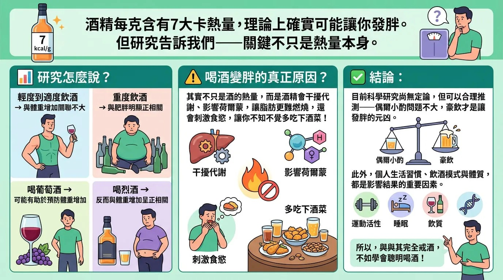

# Threads 貼文 DV0jjxwE8md

- 帳號: [@drchenghao](https://www.threads.com/@drchenghao)（程皓醫師｜好動人生。 運動與家庭醫學，已認證）
- 貼文 URL: https://www.threads.com/@drchenghao/post/DV0jjxwE8md
- 發文時間: 2026-03-13T18:25:12+08:00（UTC+8，時間戳 1773397512）
- 類型: photo
- 愛心數: 52
- 回覆數: 5
- 轉發數: 6
- 引用數: 1
- 備註: 貼文曾被編輯

## 貼文文字

最近很多朋友問，減重到底能不能喝酒 🤔
答案是，能，但要喝對🔥🔥

酒精每克含有7大卡熱量，理論上確實可能讓你發胖。但研究告訴我們，重點不只是熱量❗

輕度到適度飲酒 → 與體重增加關聯不大
重度飲酒 → 與肥胖明顯正相關
喝葡萄酒 → 可能有助於預防體重增加
喝烈酒 → 反而與體重增加呈正相關

▶️喝酒變胖的真正原因？
其實不只是酒的熱量，而是酒精會干擾代謝、影響荷爾蒙，讓脂肪更難燃燒，還會刺激食慾，讓你不知不覺多吃下酒菜！

▶️結論：
偶爾小酌問題不大，豪飲才是讓你發胖的元凶。 此外，個人生活習慣、飲酒模式與體質，都是影響結果的重要因素。
❗所以，真的要喝，拜託請適量唷❗

底下看更多文章👇

## 圖片

- 原始圖片 URL: https://scontent-sin6-3.cdninstagram.com/v/t51.82787-15/651876668_17928454938446758_5107371921155121592_n.webp?efg=eyJ2ZW5jb2RlX3RhZyI6InRocmVhZHMuRkVFRC5pbWFnZV91cmxnZW4uMTM3Ni5zZHIucmVndWxhcl9waG90by5jMiJ9&_nc_ht=scontent-sin6-3.cdninstagram.com&_nc_cat=110&_nc_oc=Q6cZ2gE1K2s1Kc_0XOqCP5tc5HGcBL_T04UMk-2F7n564jdUykOzWf0DwVYkdKoAYV_idDZSqhtr1UQ86-_G4jMBkFt3&_nc_ohc=zAGEv00vDW8Q7kNvwEibrRv&_nc_gid=15XSgUoIULX5AByrsniSQQ&edm=APs17CUBAAAA&ccb=7-5&ig_cache_key=Mzg1MTg1OTk3MTUzODE0MzY0NQ%3D%3D.3-ccb7-5&oh=00_AQLD35fgN7dcM6n_LlMeZHdt3P7J_EVGvTRYEAtif3fGTw&oe=6AA5F2F7&_nc_sid=10d13b
- 尺寸: 1376x768
