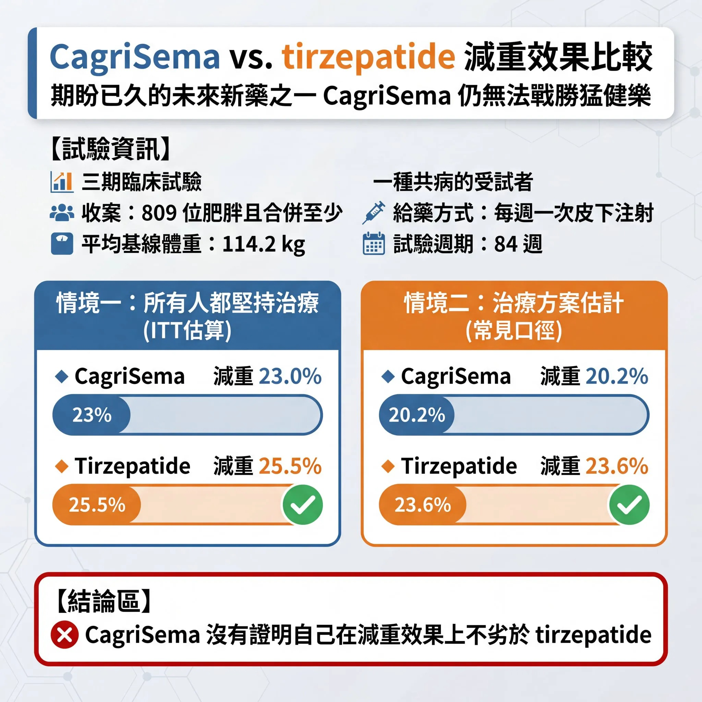

# Threads 貼文 DVIjrDOk4l4

- 帳號: [@drchenghao](https://www.threads.com/@drchenghao)（程皓醫師｜好動人生。 運動與家庭醫學，已認證）
- 貼文 URL: https://www.threads.com/@drchenghao/post/DVIjrDOk4l4
- 發文時間: 2026-02-24T16:19:37+08:00（UTC+8，時間戳 1771921177）
- 類型: photo
- 愛心數: 77
- 回覆數: 8
- 轉發數: 0
- 引用數: 0
- 備註: 貼文曾被編輯

## 貼文文字

諾和諾德令人期待的未來新藥，CagriSema
結果出爐，仍無法戰勝目前減重王者，猛健樂

最新三期試驗，收了 809 位肥胖且合併至少一種共病的受試者，平均基線體重 114.2 kg，兩組皆為每週一次皮下注射，試驗週期 84 週。

直接也血淋淋的結果：
以「所有人都堅持治療」的情境估算：
➡️ CagriSema 在 84 週減重 23.0%
➡️ tirzepatide 在 84 週減重 25.5%

以應用於現實世界估計：
➡️ CagriSema 減重 20.2%
➡️ tirzepatide 減重 23.6%

猛健樂 (Tirzepatide) 依然戰勝！

CagriSema 的減重效果其實已讓人驚訝，但現在的時代，已被嶄新的藥物重新定義，而最幸運的，還是所有需要飲控減重的族群，讓我們繼續靜觀這場大戰就好 😄

## 圖片

- 原始圖片 URL: https://scontent-sin6-3.cdninstagram.com/v/t51.82787-15/640392957_17920976130446758_2932576790251068353_n.webp?efg=eyJ2ZW5jb2RlX3RhZyI6InRocmVhZHMuRkVFRC5pbWFnZV91cmxnZW4uMjA0OC5zZHIucmVndWxhcl9waG90by5jMiJ9&_nc_ht=scontent-sin6-3.cdninstagram.com&_nc_cat=110&_nc_oc=Q6cZ2gHzg1e_HvGH9Cm3HnKx_ZVLOvsX68lq3UJ8pZ-LOqEy-Il54AU7zDRjv5jL_PYOts8olWWnpL1fPgdEyK1hPAKg&_nc_ohc=YVtlrjZP7hMQ7kNvwE3T32V&_nc_gid=nqS3ED0xIt6Ps4Ph523MCw&edm=APs17CUBAAAA&ccb=7-5&ig_cache_key=MzgzOTQ3NTU3MjM2NDUxMTYwOA%3D%3D.3-ccb7-5&oh=00_AQKUaH2GESBehLuJiPPnlqHfrk_zZtRNAJ_J1GxY4wfmAA&oe=6AA5CD5F&_nc_sid=10d13b
- 尺寸: 2048x2048
