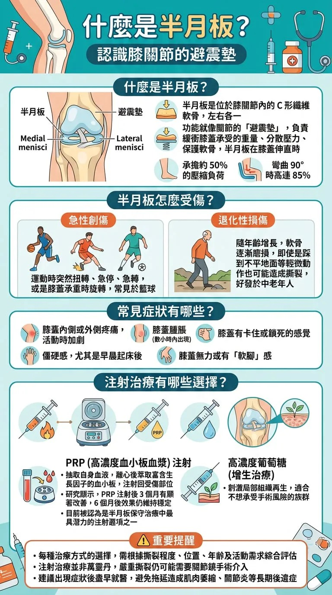

# Threads 貼文 DVYOetDk2HG

- 帳號: [@drchenghao](https://www.threads.com/@drchenghao)（程皓醫師｜好動人生。 運動與家庭醫學，已認證）
- 貼文 URL: https://www.threads.com/@drchenghao/post/DVYOetDk2HG
- 發文時間: 2026-03-02T18:22:16+08:00（UTC+8，時間戳 1772446936）
- 類型: photo
- 愛心數: 32
- 回覆數: 3
- 轉發數: 5
- 引用數: 2

## 貼文文字

半月板，膝蓋的避震墊
是籃球、排球選手最容易受傷的部位之一

❗俗話說，十個籃球選手九個半月板有問題❗
一起來看看它到底是什麼吧！

## 圖片

- 原始圖片 URL: https://scontent-sin6-3.cdninstagram.com/v/t51.82787-15/645571091_17923830609446758_4466708265052479428_n.webp?efg=eyJ2ZW5jb2RlX3RhZyI6InRocmVhZHMuRkVFRC5pbWFnZV91cmxnZW4uNzY4LnNkci5yZWd1bGFyX3Bob3RvLmMyIn0&_nc_ht=scontent-sin6-3.cdninstagram.com&_nc_cat=110&_nc_oc=Q6cZ2gFJKePlkNuMh_5SWYA9lPBTDTgYxyFoxAeoaCPHFBAPS-v4NOod9gmK7Cqy4hIIjbgQ6ra_wZwpK1I0OCLeCYK_&_nc_ohc=fmpwsG-4W5sQ7kNvwHD440d&_nc_gid=9KVg-581hs9i-cSIbIAZKA&edm=APs17CUBAAAA&ccb=7-5&ig_cache_key=Mzg0Mzg4NTk2NDU3NDU0ODQyMg%3D%3D.3-ccb7-5&oh=00_AQIgL4y_qp54Cl7mbOuAa_VnFAvXpXWZei-CCl69GNLlOQ&oe=6AA5D7FC&_nc_sid=10d13b
- 尺寸: 768x1376
