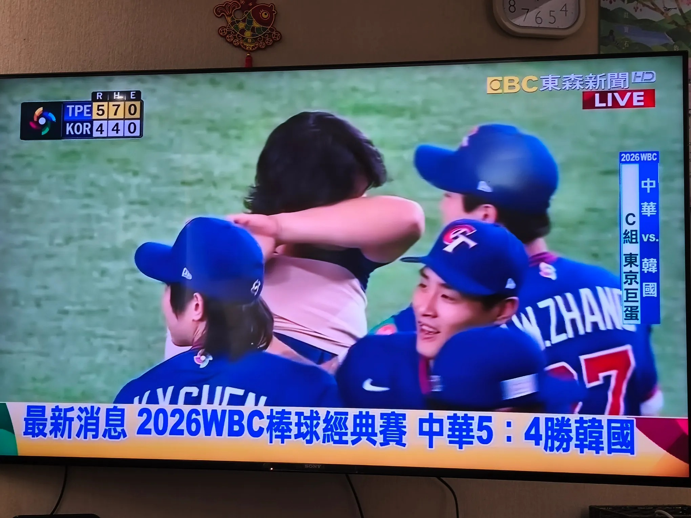

# Threads 貼文 DVnOSliEz5r

- 帳號: [@drchenghao](https://www.threads.com/@drchenghao)（程皓醫師｜好動人生。 運動與家庭醫學，已認證）
- 貼文 URL: https://www.threads.com/@drchenghao/post/DVnOSliEz5r
- 發文時間: 2026-03-08T14:09:13+08:00（UTC+8，時間戳 1772950153）
- 類型: photo
- 愛心數: 251
- 回覆數: 4
- 轉發數: 0
- 引用數: 0
- 備註: 貼文曾被編輯

## 貼文文字

中華隊 5：4 獲勝！！
太了不起了，
排除鍋貼魔咒，
第一次一級賽事贏下韓國

明天不管如何，這趟值了🥹🥹

## 圖片

- 原始圖片 URL: https://scontent-sin6-3.cdninstagram.com/v/t51.82787-15/649228133_17926261959446758_7516450696043293797_n.webp?efg=eyJ2ZW5jb2RlX3RhZyI6InRocmVhZHMuRkVFRC5pbWFnZV91cmxnZW4uMjA0MC5zZHIucmVndWxhcl9waG90by5jMiJ9&_nc_ht=scontent-sin6-3.cdninstagram.com&_nc_cat=110&_nc_oc=Q6cZ2gE1K2s1Kc_0XOqCP5tc5HGcBL_T04UMk-2F7n564jdUykOzWf0DwVYkdKoAYV_idDZSqhtr1UQ86-_G4jMBkFt3&_nc_ohc=QzmAAp4hlqsQ7kNvwFxllDd&_nc_gid=15XSgUoIULX5AByrsniSQQ&edm=APs17CUBAAAA&ccb=7-5&ig_cache_key=Mzg0ODEwNzI1NjUxMzI0ODg3NQ%3D%3D.3-ccb7-5&oh=00_AQI8cr9yMywkNASulKbZArj2jhsTrjcAb_Ln-mTWCJfACA&oe=6AA5D457&_nc_sid=10d13b
- 尺寸: 2040x1530
