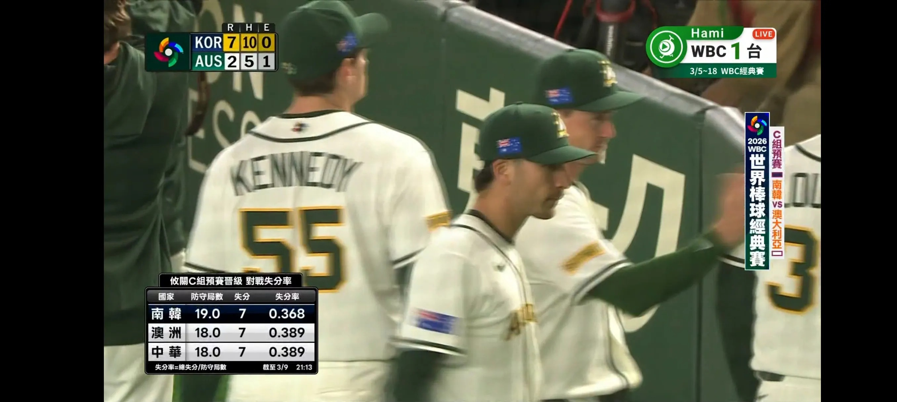

# Threads 貼文 DVqj0iQE8m2

- 帳號: [@drchenghao](https://www.threads.com/@drchenghao)（程皓醫師｜好動人生。 運動與家庭醫學，已認證）
- 貼文 URL: https://www.threads.com/@drchenghao/post/DVqj0iQE8m2
- 發文時間: 2026-03-09T21:15:05+08:00（UTC+8，時間戳 1773062105）
- 類型: photo
- 愛心數: 10
- 回覆數: 0
- 轉發數: 0
- 引用數: 0
- 備註: 此貼文為作者回覆自己的續文（self-thread），屬於同時發布的貼文群組 [DVqjtj9k_YX](https://www.threads.com/@drchenghao/post/DVqjtj9k_YX)

## 貼文文字

（無文字內容）

## 圖片

- 原始圖片 URL: https://scontent-sin6-3.cdninstagram.com/v/t51.82787-15/649227314_17927123877446758_3515087688982377722_n.webp?efg=eyJ2ZW5jb2RlX3RhZyI6InRocmVhZHMuRkVFRC5pbWFnZV91cmxnZW4uMjcxMi5zZHIucmVndWxhcl9waG90by5jMiJ9&_nc_ht=scontent-sin6-3.cdninstagram.com&_nc_cat=110&_nc_oc=Q6cZ2gE1K2s1Kc_0XOqCP5tc5HGcBL_T04UMk-2F7n564jdUykOzWf0DwVYkdKoAYV_idDZSqhtr1UQ86-_G4jMBkFt3&_nc_ohc=miHOASEJMEkQ7kNvwHOncyE&_nc_gid=15XSgUoIULX5AByrsniSQQ&edm=APs17CUBAAAA&ccb=7-5&ig_cache_key=Mzg0OTA0NjM3MzM1OTE0MzM1MA%3D%3D.3-ccb7-5&oh=00_AQIFOYN7PTpNmwQ30HSFm_wBGYV9ggG5N1heWt-yAYwlvA&oe=6AA5CC49&_nc_sid=10d13b
- 尺寸: 2712x1220
