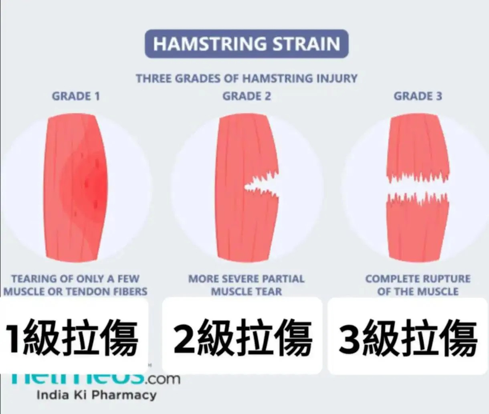

# Threads 貼文 DWsDeJhE94y

- 帳號: [@drchenghao](https://www.threads.com/@drchenghao)（程皓醫師｜好動人生。 運動與家庭醫學，已認證）
- 貼文 URL: https://www.threads.com/@drchenghao/post/DWsDeJhE94y
- 發文時間: 2026-04-04T07:42:17+08:00（UTC+8，時間戳 1775259737）
- 類型: photo
- 愛心數: 294
- 回覆數: 29
- 轉發數: 5
- 引用數: 10
- 備註: 貼文曾被編輯

## 貼文文字

Luka 竟然腿後肌拉傷了🥲
趕快來看看多久有機會回來

平均回場時間，
✅ 輕度拉傷（I級）：平均7-10天
✅ 中度拉傷（II級）：3-6週
✅ 完全斷裂（III級）：需手術+3-6個月以上

Luka 傷後仍能自行行走，若MRI顯示無肌腱斷裂，推測為I至II 級損傷：
▶️樂觀預估：若傷勢輕微、恢復順利，且通過前述測試，且與團隊協調後，至少 2 週左右回場（但短期內上場再傷率非常高）

▶️保守預估：若為嚴重撕裂傷甚至完全斷裂，可能缺席整個季後賽
---

🛑 個人觀點：
腿後肌拉傷、撕裂傷理想情況需要休2週以上，但考量Luka對於球隊之重要性及比賽重要性，可能調整時辰。只求回場後能夠控制上場時間並祈禱不要發生類似KD、KT的慘案 🥹

## 圖片

- 原始圖片 URL: https://scontent-sin6-3.cdninstagram.com/v/t51.82787-15/659262556_17935755333446758_6434528156311504548_n.webp?efg=eyJ2ZW5jb2RlX3RhZyI6InRocmVhZHMuRkVFRC5pbWFnZV91cmxnZW4uMTIyMC5zZHIucmVndWxhcl9waG90by5jMiJ9&_nc_ht=scontent-sin6-3.cdninstagram.com&_nc_cat=110&_nc_oc=Q6cZ2gH7ntRRt_g4L6wUHv9tRf3KwxpzAjY0d2PtSirA1_aVzF949tNVsHaW5lN59drra2ZiLnC59RPgGp1w_mo3EOso&_nc_ohc=MVgOb92cB6MQ7kNvwHJoQeJ&_nc_gid=kdbsLC1FKbaheLjo8GR4Lg&edm=APs17CUBAAAA&ccb=7-5&ig_cache_key=Mzg2NzQ4MTQ0NTk0Njg3NTQ0Mg%3D%3D.3-ccb7-5&oh=00_AQL07JFoyqUWZnQwkdBnokv3myEE2UKcBYkqrmhgKL31Pg&oe=6AA5F003&_nc_sid=10d13b
- 尺寸: 1220x1035
