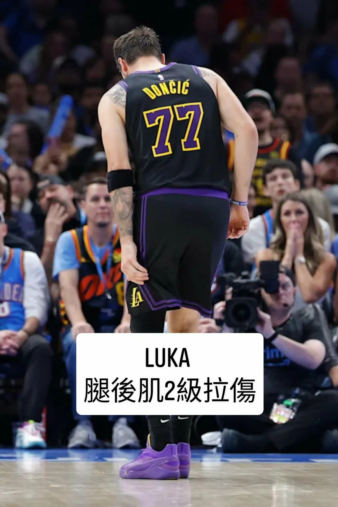

# Threads 貼文 DWsMj7vE8yV

- 帳號: [@drchenghao](https://www.threads.com/@drchenghao)（程皓醫師｜好動人生。 運動與家庭醫學，已認證）
- 貼文 URL: https://www.threads.com/@drchenghao/post/DWsMj7vE8yV
- 發文時間: 2026-04-04T09:01:43+08:00（UTC+8，時間戳 1775264503）
- 類型: photo
- 愛心數: 27
- 回覆數: 4
- 轉發數: 0
- 引用數: 1
- 備註: 貼文曾被編輯

## 貼文文字

Luka 確定是 腿後肌2級拉傷，至少休 3-6週

但以季後賽強度而言，絕對建議他好好休養，
若勉強上場，再傷率真的太高了

拜託真的要好好休，你還有大把生涯 

An MRI revealed Dončić suffered a Grade 2 left hamstring strain

## 圖片

- 原始圖片 URL: https://scontent-sin6-3.cdninstagram.com/v/t51.82787-15/658028261_17935769667446758_5818302346373915811_n.webp?efg=eyJ2ZW5jb2RlX3RhZyI6InRocmVhZHMuRkVFRC5pbWFnZV91cmxnZW4uMTIyMC5zZHIucmVndWxhcl9waG90by5jMiJ9&_nc_ht=scontent-sin6-3.cdninstagram.com&_nc_cat=110&_nc_oc=Q6cZ2gH7ntRRt_g4L6wUHv9tRf3KwxpzAjY0d2PtSirA1_aVzF949tNVsHaW5lN59drra2ZiLnC59RPgGp1w_mo3EOso&_nc_ohc=40zltuV0-j4Q7kNvwEy93e7&_nc_gid=kdbsLC1FKbaheLjo8GR4Lg&edm=APs17CUBAAAA&ccb=7-5&ig_cache_key=Mzg2NzUyMTQyNTg4NDgyNjc3Mw%3D%3D.3-ccb7-5&oh=00_AQI7Aj8ZN9yuQ2iSXHnBFDM3RNuF8DfMG8WZ1F_XEkPnJg&oe=6AA5D782&_nc_sid=10d13b
- 尺寸: 1220x1831
