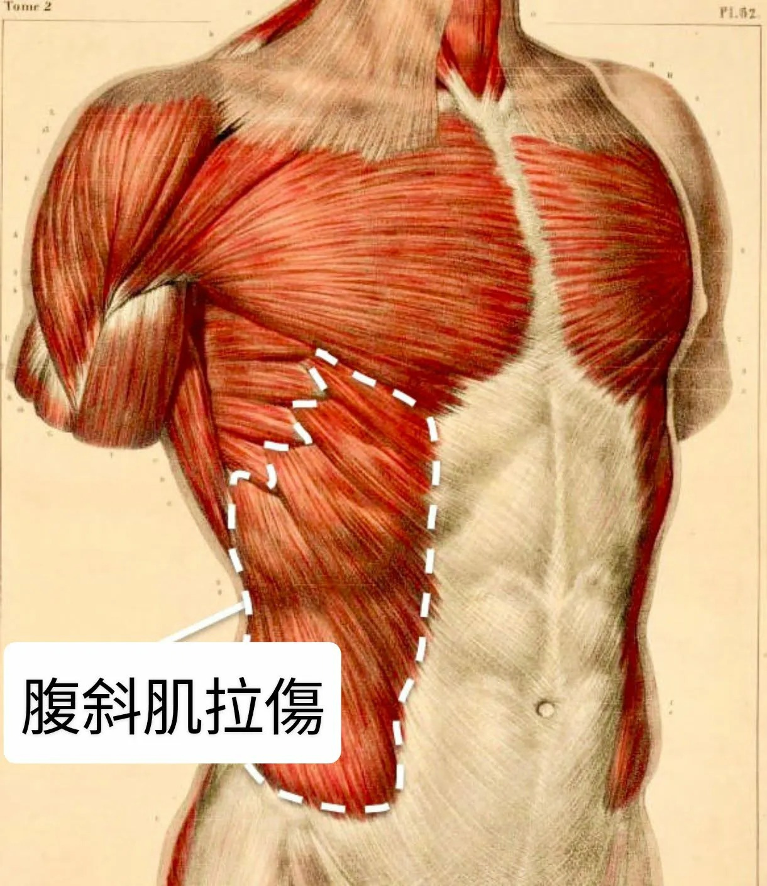

# Threads 貼文 DWug2lek_4e

- 帳號: [@drchenghao](https://www.threads.com/@drchenghao)（程皓醫師｜好動人生。 運動與家庭醫學，已認證）
- 貼文 URL: https://www.threads.com/@drchenghao/post/DWug2lek_4e
- 發文時間: 2026-04-05T06:37:30+08:00（UTC+8，時間戳 1775342250）
- 類型: photo
- 愛心數: 86
- 回覆數: 3
- 轉發數: 1
- 引用數: 2

## 貼文文字

湖人竟然又有噩耗 🥲
Austin Reaves 被診斷為左側腹斜肌二級拉傷，將缺席本賽季剩餘的例行賽，目前根據球團說明，預計休四到六週。

小補充，腹斜肌可能影響跑動、旋轉、呼吸等，甚至還是2級，意指有部分撕裂傷的情況，好好休養絕對是必須的
湖人這波，第一輪季後賽將缺席兩員大將，真的是走到哪算哪吧，別讓球星有更多傷勢才是最重要的

___________底下原文___________
Los Angeles Lakers guard Austin Reaves has been diagnosed with a Grade 2 left oblique muscle injury and is out for the remainder of the regular season.

## 圖片

- 原始圖片 URL: https://scontent-sin6-3.cdninstagram.com/v/t51.82787-15/658218876_17936063256446758_3763182846607439999_n.webp?efg=eyJ2ZW5jb2RlX3RhZyI6InRocmVhZHMuRkVFRC5pbWFnZV91cmxnZW4uMTIyMC5zZHIucmVndWxhcl9waG90by5jMiJ9&_nc_ht=scontent-sin6-3.cdninstagram.com&_nc_cat=110&_nc_oc=Q6cZ2gE0rwfo7HL_5y7EnalhiaIbeLWOfIZ9fs4G4CgjXepBLOtGRZVkED446jw5Yz0jz-tz7CfrRT2O-tlqa7NpP8pQ&_nc_ohc=I8okghH3J0IQ7kNvwEROewo&_nc_gid=J_bw93wzZXy3zjx58lmJFA&edm=APs17CUBAAAA&ccb=7-5&ig_cache_key=Mzg2ODE3MzYxODUzOTM5NjYzOA%3D%3D.3-ccb7-5&oh=00_AQIMNwjg5BcPNgXjHhV9aT0Wv48yKLLsPQsCwpM82PVALw&oe=6AA5E4A6&_nc_sid=10d13b
- 尺寸: 1220x1408
