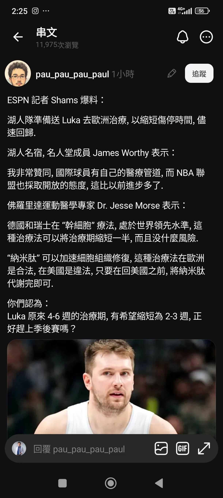

# Threads 貼文 DWx8agGE7Mo

- 帳號: [@drchenghao](https://www.threads.com/@drchenghao)（程皓醫師｜好動人生。 運動與家庭醫學，已認證）
- 貼文 URL: https://www.threads.com/@drchenghao/post/DWx8agGE7Mo
- 發文時間: 2026-04-06T14:36:03+08:00（UTC+8，時間戳 1775457363）
- 類型: photo
- 愛心數: 110
- 回覆數: 23
- 轉發數: 0
- 引用數: 1

## 貼文文字

看到 Luka 新聞其實有點驚訝，
雖然不確定此種療法為何，
但如果依台灣情況，可能為PRP或是脂肪幹細胞於局部組織注射，加速修復

儘管有機會加速修復，但完全不建議提早上場，因為無證據顯示能確保修復品質如何，且再傷率可能依然很高，勉強壓線上場，可能會有更因嚴重結果

雖然完全能理解 77 出戰對於球團的好處，
但這真的是讓人擔心..🥹

## 圖片

- 原始圖片 URL: https://scontent-sin6-3.cdninstagram.com/v/t51.82787-15/661302901_17936442678446758_5891052613738372605_n.webp?efg=eyJ2ZW5jb2RlX3RhZyI6InRocmVhZHMuRkVFRC5pbWFnZV91cmxnZW4uMTIyMC5zZHIucmVndWxhcl9waG90by5jMiJ9&_nc_ht=scontent-sin6-3.cdninstagram.com&_nc_cat=110&_nc_oc=Q6cZ2gE0rwfo7HL_5y7EnalhiaIbeLWOfIZ9fs4G4CgjXepBLOtGRZVkED446jw5Yz0jz-tz7CfrRT2O-tlqa7NpP8pQ&_nc_ohc=Xg7u1kxLpcUQ7kNvwFuRqIp&_nc_gid=J_bw93wzZXy3zjx58lmJFA&edm=APs17CUBAAAA&ccb=7-5&ig_cache_key=Mzg2OTEzOTI1ODg0NjcyMDgwOA%3D%3D.3-ccb7-5&oh=00_AQLM1Uw1gWm_y6R41bC-YLIjiCtxyov4teLkT80qwvHTrQ&oe=6AA5D8FD&_nc_sid=10d13b
- 尺寸: 1220x2712
