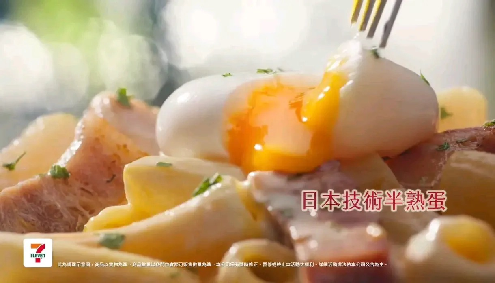

# Threads 貼文 DX3Thh9E9rA

- 帳號: [@drchenghao](https://www.threads.com/@drchenghao)（程皓醫師｜好動人生。 運動與家庭醫學，已認證）
- 貼文 URL: https://www.threads.com/@drchenghao/post/DX3Thh9E9rA
- 發文時間: 2026-05-03T13:05:35+08:00（UTC+8，時間戳 1777784735）
- 類型: photo
- 愛心數: 1060
- 回覆數: 33
- 轉發數: 99
- 引用數: 9
- 備註: 貼文曾被編輯

## 貼文文字

營養小知識，
超商便當的半熟蛋，可能是合成蛋 🥲

你在便當、飯糰內看到的”爆蛋”，可能是加工品！ 加工蛋安全性經檢驗，有保障，添加劑符合國際食品規範，偶爾食用無虞。

但相較於真蛋（每顆約6g蛋白質、富含維生素），加工蛋因添加油脂和糖漿，營養密度較低，鈉含量較高，建議每周1-2次就好唷~

PS ：以後我買便當又要多注意了 🥹
PS2：還是媽媽或自己煮的蛋最好~

## 圖片

- 原始圖片 URL: https://scontent-sin6-3.cdninstagram.com/v/t51.82787-15/683388727_17947619094446758_5347634550398421083_n.webp?efg=eyJ2ZW5jb2RlX3RhZyI6InRocmVhZHMuRkVFRC5pbWFnZV91cmxnZW4uMTIyMC5zZHIucmVndWxhcl9waG90by5jMiJ9&_nc_ht=scontent-sin6-3.cdninstagram.com&_nc_cat=110&_nc_oc=Q6cZ2gGtzeooKNU8qEa8yVEw5ElVL9D32tauf7IHHIQSq07jdWl-7FG8Q_4I4hG_qXUZwHj6b2d9e3_SKUjLiC14fkoI&_nc_ohc=8TcYP-XMZ_4Q7kNvwE8jC_D&_nc_gid=hl55HmGLl-ZthrKQTmaNgQ&edm=APs17CUBAAAA&ccb=7-5&ig_cache_key=Mzg4ODY2MjY3MDM0MjM0NzQ1Ng%3D%3D.3-ccb7-5&oh=00_AQIkhvi6GYPpkcOP4A_Huv-7ThrlP1XRDTPlCyMETFMMSg&oe=6AA5CBD2&_nc_sid=10d13b
- 尺寸: 1220x700
